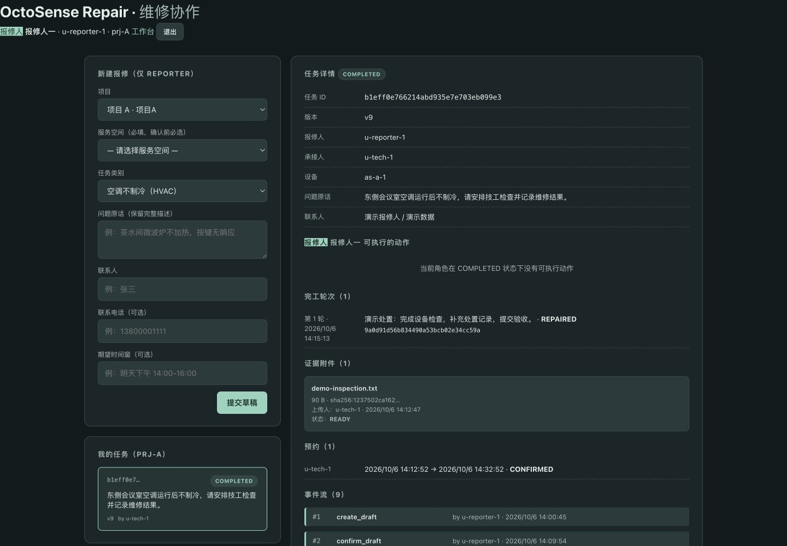

# 知了 · 维修任务协作

> **当前上传为待修复候选，未通过完整验收。** 最新独立复验与剩余问题见[当前候选状态](submission/2026-10-06-native/CURRENT_REVIEW_STATUS.md)；下文旧完成截图和历史验证表述不代表当前版本已通过。

队伍名：**知了**。Agentic App 2026 初赛项目，围绕同一项维修任务组织报修人、技工与项目经理的协作：报修 → 接单 → 设备确认 → 预约 → 处置 → 完工 → 独立验收 / 退回重做。

## 演示与提交材料

**两条独立交付（A 版 + B 版），不互相覆盖**。

### A 版（Web/后端演示与比赛材料 · 2026-10-06）

固定 commit `6d81d57b1436c6df3c233b65b9313e3a3bf9d84b`。入口 [submission/2026-10-06/README.md](submission/2026-10-06/README.md)。

- [82 秒正式普通话视频](submission/2026-10-06/video/zhiliao-demo-putonghua.mp4)（用户选定 Serena 温和女声 + 原创器乐）
- [7 张截图](submission/2026-10-06/screenshots/README.md)（Web 演示页面 + 原生界面占位）
- [A 版应用包](submission/2026-10-06/bundle/octosense-repair-0.1.0.zip)（stamp blake3 `eff13f557080fc12ac2961f6bee83a2365f3d8fb5ac0e56681cee45b13c4ad26`）
- [A 版核验与边界](submission/2026-10-06/VERIFICATION.md)

### B 版（最新 OctoSense 原生候选 · 2026-10-06）

固定 tag `octosense-repair-b-v0.1.0`（待用户授权后冻结）。入口 [submission/2026-10-06-native/README.md](submission/2026-10-06-native/README.md)。

- [6 张真实原生截图](submission/2026-10-06-native/screenshots/)（覆盖 DRAFT→OPEN→ACCEPTED→SCHEDULED→IN_PROGRESS→AWAITING_ACCEPTANCE→COMPLETED 全闭环 + 重启回读）
- [B 版应用包](submission/2026-10-06-native/bundle/octosense-repair-0.1.0-b.zip)（stamp blake3 `e5b477c73bbee2b7a779661c6845d061e8ec53ff46d9b75dd47435702da16579`，1.5 MiB）
- [B 版核验清单](submission/2026-10-06-native/VERIFICATION.md)
- [B 版已知限制](submission/2026-10-06-native/KNOWN_LIMITATIONS.md)
- [B 版组件版本来源](submission/2026-10-06-native/SOURCES.md)
- [B 版 App Hub Issue 草稿](submission/2026-10-06-native/HUB_ISSUE.md)（待用户授权后发出）
- [主办方进展说明草稿](submission/2026-10-06-native/HOST_NOTE.md)（待用户授权后发出）

A 版与 B 版关键差异：



## 当前验证状态

### B 版（最新 OctoSense 原生候选）— 构建成功 + 原生验证通过 + 待递交

- **hub stamp**：blake3 `e5b477c73bbee2b7a779661c6845d061e8ec53ff46d9b75dd47435702da16579`，幂等验证通过。
- **hub check**：`octosense-repair 0.1.0 — PASSED`（仅 publisher-signature unsigned warning，已声明首版 unsigned）。
- **hub scan**：packet 7 项问题已逐条答复，route = pass（建议人类复核但不阻塞）。
- **原生闭环**：DRAFT→OPEN→ACCEPTED→SCHEDULED→IN_PROGRESS→AWAITING_ACCEPTANCE→COMPLETED 由真实 card-host（Hub@6741dea / Shell@a5d847a / Octoscript@68f6a9df / Octoscript-Makepad@b33f494b / Makepad@4fdcfccc）加载本应用 `main.splash` 实测跑通；6 张真实原生截图存档。
- **N1/N2 修复**：取消 ScrollYView + `fn tick()` 1Hz + `refreshLabels(taskToShow)` 命名 Label 主动更新；`pick`/`me` 重命名为 `pickUser`/`getMe` 解除 OctoScript 内置函数遮蔽。
- **持久化与重启**：state.json / tasks.json / actions.jsonl / events.jsonl 在 `--app-data` 真实落盘；`kill card-host && 重启` 后任务列表与事件流完整回读。
- **不冒充通过**：App picker、隔离存储读字节 API、grant 生命周期、真实模型接入仍为已知限制；详见 [B 版 KNOWN_LIMITATIONS](submission/2026-10-06-native/KNOWN_LIMITATIONS.md)。

### A 版（Web/后端演示与比赛材料）— 已递交素材

- **固定 commit**：`6d81d57b1436c6df3c233b65b9313e3a3bf9d84b`。
- **82 秒正式普通话视频 + 7 张截图 + 应用包** 全部就位。
- **业务验证**：后端 190 项单测通过（63.70s），17 步 HTTP E2E PASS（含退回、幂等回放与终态拒绝）。

### 整体 NOT READY · 区分四个状态

构建成功 ≠ 原生验证通过 ≠ 已递交 ≠ 已收录。当前：

- B 版：**构建成功 + 原生验证通过 + 待递交**（App Hub Issue 草稿 [HUB_ISSUE.md](submission/2026-10-06-native/HUB_ISSUE.md) 待用户授权发出；推 origin 与 tag 冻结同样待用户授权）。
- A 版：**构建成功 + 已递交比赛素材**（仓库 `6d81d57b` 已就位；比赛官方回执与 Hub 收录仍未到位）。
- 验收台账：31 PASS / 28 NOT_RUN / 2 FAIL / 3 BLOCKED（VALID 结构）；后端 P0 缺陷（T02/T03/T05/T08/T16/T17/T18/T29）与原生 T29 grant 仍未修，详见 `docs/build-loop/REVIEW_2026-10-02.md` 与 B 版 KNOWN_LIMITATIONS。
- AI 助手、grant 自动决策属于待接通范围；视频配音模型（Serena / Qwen3-TTS / MLX）与应用 AI 能力无关。
- 此前仓库登记记录见 [源码提交回执](docs/build-loop/REPOSITORY_SUBMISSION_2026-10-02.md)。

## 本地运行

```sh
uv sync --frozen --directory backend
backend/.venv/bin/python scripts/run_local.py --port 8711 --web-port 8712 --runtime runtime/demo
```

浏览器打开 `http://127.0.0.1:8712/`，选择演示身份。服务只绑定本机，任务、证据及日志写入 `runtime/`。本轮验证了现有开发环境启动；未宣称全新机器依赖安装已验证。

原生应用入口为 `app/bundle/main.splash`，需安装匹配版本的 OctoSense/card-host；它不随包安装 Python 后端。参见 [应用运行说明](app/README.md) 与 [平台边界](app/docs/route-decision.md)。

## 项目文件导航

| 目录 | 内容 |
|---|---|
| `app/bundle/` | 原生 OctoScript 应用、manifest、listing、图标与原生截图 |
| `backend/src/octosense_backend/` | 独立维修任务领域后端 |
| `backend/tests/octosense_backend/` | 当前领域单元测试 |
| `app/demo-web/` | 本地浏览器演示与 API 代理，不进入原生包 |
| `submission/2026-10-06/` | 本次可直接查看、下载和上传的比赛材料 |
| `docs/implementation/` | 需求、架构、接口和构建计划；设计不等于实现 |
| `docs/build-loop/` | 验收台账、审查与修复记录；按记录时间阅读 |
| `runtime/` | 本地数据库、模型、虚拟环境、日志与备份；不提交 |

旧 `wagent_backend` 保留为独立迁移与回归资产，其 contracts 不在本轮重写。历史背景见 [架构](docs/ARCHITECTURE.md)、[迁移](docs/MIGRATION.md)、[核验记录](docs/VERIFICATION.md)。

许可：[Apache-2.0](LICENSE)。数据来源见 [仿真种子说明](backend/data/simseed/PROVENANCE.md) 和 [本地演示数据说明](docs/PRIVACY.md)。
