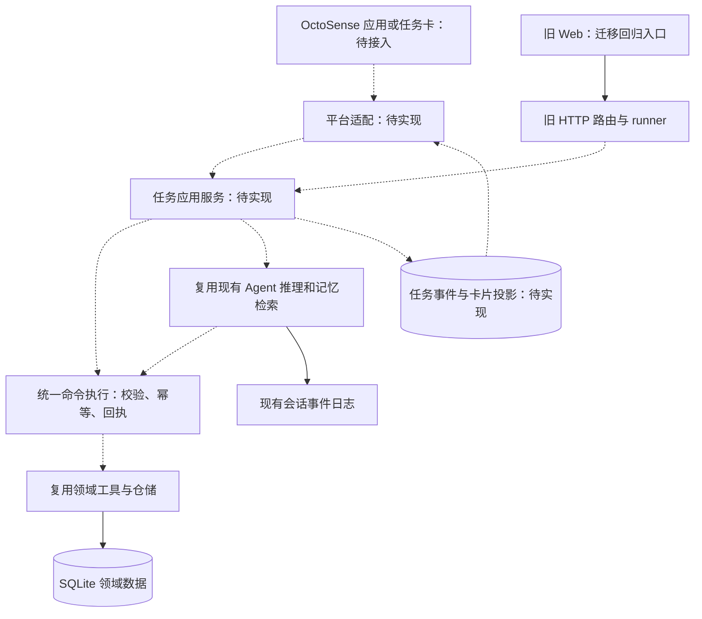

# 架构入口：比赛版设计与迁移历史

**9月30日实施循环：[15石墨版构建与验证](implementation/15_BUILD_VERIFY_LOOP.md)**。按真实最小切片裁决身份/存储/宿主后，逐段创建报单至独立验收和恢复；不能以UI完成替代闭环。正式UI为石墨，平台边界继续按14/13执行。

**当前接入增量：[14课程 #2 与最新源码裁决](implementation/14_COURSE2_LATEST_GUIDE_REVIEW.md)**。优先按第5节新图理解main.splash→宿主助手/结构化模型→建议确认→统一命令→唯一任务权威；AI服务已合并但有开关、内核及同意前提。13的身份、持久化和包边界保留，本项目G0尚无通过证据。

**当前接入约束：[13 Hub实证修订](implementation/13_APP_HUB_SUBMISSION_REVIEW.md)**。Hub脚本应用作为交付候选；本地领域执行或包外HTTPS服务尚待G0裁决。下文旧Rust broker、Python本机服务与SQLite部署均不得直接视为可安装Hub方案。领域规则保留，未授权公网迁移。

当前日期与实施顺序见[12交付排期](implementation/12_DELIVERY_PLAN_20261009.md)：10月6日晚主要功能完成，10月7日验收，10月8日优先提交，10月9日初赛截止。业务方向不变。

> 最新依据为[研讨课 #1 对照修订](implementation/11_COURSE1_BASELINE_REVIEW.md)。原生目标保留，但原robrix2不再被视为全部作品唯一宿主；Python复用和具体配对方式须重新过G0。迁移来源与领域业务规则不变。

## 早期v1.1增量记录（2026-09-26，宿主细节以11为准）

先读[07顶层决策](implementation/07_REVISION_20260926.md)、[08已有代码复用](implementation/08_REUSE_MIGRATION.md)、[09 Agent运行](implementation/09_AGENT_HARNESS.md)。Rust宿主/Python领域核心仍为默认路线；不能从会议摘要推导全后端语言强制要求，课程包与混合接入需实测。增加AgentRuntimePort、IntentSpec内部建议、独立Verifier；保留设备事实/事件历史/经验召回，业务状态和接口不变。Web缩为配对与必要回归。图册新增第六张；本轮只改设计和检查脚本，没有新增业务实现。

## v1业务设计记录（2026-09-22，保留领域规则）

用户已明确：本地实现报单、接单、设备身份、桌面展示、预约、进度、完工与验收，外部工单仅预留写入接口。最新[编码交付包](implementation/README.md)与[五张架构图](implementation/ARCHITECTURE.html)替代下文尚待讨论的功能范围、状态候选和接口草案。

当前选型为robrix2原生宿主 + Python/FastAPI模块化后端 + 新runtime/repair.db。本地维修任务是本轮权威，旧ops库隔离保留，不双写；新旧入口的业务写入统一经过任务执行边界，未迁移旧写入口在比赛模式禁用。Web仅为回归与配对管理页。用户偏好、自动学习效果不是本轮P0。

源代码仍是迁移基线；新设计尚未实现。按[需求](implementation/01_REQUIREMENTS.md)、[详细架构](implementation/02_ARCHITECTURE.md)、[技术栈](implementation/03_TECH_STACK.md)、[数据API](implementation/04_DATA_API.md)及[实施验收](implementation/05_IMPLEMENTATION_ACCEPTANCE.md)编码。宿主版本/原生桥接必须实测，见[官方要求映射](implementation/06_OFFICIAL_COMPLIANCE.md)。

修改业务时同步需求、命令、SQL、图册和验收；官方版本变化先更新合规矩阵。下文保留为2026-09-21迁移决策记录，发生冲突时不得以旧候选覆盖当前设计。

## 以下为迁移历史：保留运维核心，建立独立任务层

日期：2026-09-21。状态：迁移与设计基线。设计判断置信度：高；OctoSense 接入方式和工作量：待实际 SDK 验证。

## 1. 决策及边界

选择**在新工程中局部调整架构，并以适配层接入赛事平台**。保留现有 Python 业务能力和测试，不在旧工程继续叠功能，也不把成熟的运维逻辑全部改写为 Rust。新工程第一阶段仍是单进程、模块化后端和 SQLite。

用户价值假设：报修能持续跟到验收；处理结果改变后续建议；明确的用户偏好减少重复沟通。首个功能场景建议为空调重复故障，但用户流程、状态字段和交互细节在新空间讨论后再定。

本次没有实现任务卡、用户画像或自纠错升级。复制旧源码是为了保存可验证起点，不意味着原架构已经是最终版。

## 2. 当前代码与目标结构

现状：FastAPI `web/routes_ops.py` 组织会话、查询和部分人工操作；`ops/agent/runner.py` 调模型和业务工具；`ops/tools/impl.py` 直接访问仓储并产生业务结果；SQLite 保存领域数据，JSONL 保存会话。GraphRAG 为同进程的辅助子系统。

目标结构（虚线表示待开发）：

关键点：任务层负责“这件事办到哪里”，模型负责提出下一步，工具负责确定性读写。平台界面消费任务状态，不成为工单或记忆的第二个事实库。

## 3. 模块责任和放置位置

| 模块 | 本次状态 | 后续放置与修改方式 |
|---|---|---|
| 领域契约与运维工具 | 原样复制 | 保留 `backend/src/wagent_backend/ops/contracts/`、`ops/tools/`、`ops/data/`；先保持旧行为兼容 |
| Agent、模型客户端、会话日志 | 原样复制 | 保留 `ops/agent/`、`llm/`；新任务保存其会话引用，不把会话当业务任务 |
| 任务应用服务 | 仅设计 | 拟新增 `backend/src/wagent_backend/application/`，集中任务生命周期、确认、执行、反馈与恢复 |
| 任务协议及投影 | 仅设计 | 拟新增 `backend/src/wagent_backend/task_contracts/`；独立版本化，避免改写旧 Decision 结构 |
| 统一副作用执行 | 仅设计 | 由 application 调用旧工具；改造旧 runner 的写操作路径，人工路由同步收敛，避免两套检查 |
| OctoSense 适配 | 仅设计 | 接入说明先放 `integrations/octosense/`；根据已发布 SDK 决定最小宿主代码和通信方式 |
| 用户偏好 | 仅设计 | application 管理用户/项目范围、来源、修改与撤销；存储表后续有版本迁移，不塞进设备洞察表 |
| 旧 UI 与 GraphRAG | 兼容保留 | 保留整个依赖闭包，作为回归和证据查看入口；首个任务卡不扩建图谱 |
| 效果评测 | 未迁移为能力 | 后续在 Agent 运行目录之外建立评测数据与脚本；当前只有原测试，没有完整批量效果评测 |

复制阶段不先抽包、改名或拆服务：当前 `web/app.py` 同时挂载图谱与运维路由，删去图谱会连带改入口、依赖注入和测试。保留这部分比本轮强行精简更可控，未来可在应用入口拆分时再裁剪。

## 4. 三种标识必须区分

- **任务 ID**：持续业务事项，同一事项可以跨多次会话和平台重启。
- **会话 ID**：一次或多次模型交互及其日志，不用于代替用户身份。
- **工单 ID**：领域系统中的具体维修记录；一个任务是否允许多个工单需在功能讨论中确定。

任务卡携带稳定任务 ID、状态版本和信息来源。卡片移动到其他宿主位置后，读取同一个任务投影，不能复制出第二个任务。数据库状态是事实，聊天总结只是一种描述。

## 5. 最小自有协议草案（不是 OctoSense 官方 API）

只定义职责，不在本轮假定 URL、SDK 方法或具体字段已定：

| 操作 | 最小语义 |
|---|---|
| 输入事件 | 标注来源与来源事件 ID；重复投递不重复创建任务 |
| 读取任务 | 返回版本、状态、依据、待确认事项、可执行动作和更新时间 |
| 提交动作 | 携带任务 ID、预期版本、动作类型和幂等键；校验身份/范围、前置状态与确认内容 |
| 读取变化 | 按事件序号恢复，断线重连不丢业务事件；HTTP/SSE 或官方协议待 SDK 决定 |
| 提交验收 | 引用实际工单与可追溯的验收记录；不把模型自己生成的结论视为外部事实 |

任务卡不能直接调用裸数据库或任意旧写接口。旧 runner 与手工派单等入口最终共享同一命令执行器；不能只把新界面包在旧接口外面就声称有统一控制。

## 6. 状态、执行和恢复原则

候选状态包括：待补充、待确认、执行中、待验收、已完成、需人工、执行失败。它们是讨论起点，不是已冻结协议。聊天结束、模型输出 Decision、建单成功均不自动等同于维修完成。

一次确认绑定具体提案及版本；方案变化后旧确认失效。重复点击和重试须返回原回执，不重复建单。外部请求超时但结果未知时先查回执或对账，不能盲目重发。任务状态、动作记录和本地事件应在一个事务内提交；跨外部系统时以待投递事件及结果回写恢复，不能许诺数据库和外部服务天然原子一致。

停机恢复从持久化任务和动作记录开始，而不是让模型重读聊天后猜测已执行步骤。JSONL 会话日志继续用于排障，不作为唯一的业务事务日志。

## 7. 记忆与纠错边界

保留设备事实、历史事件、归纳洞察三个层次；新增用户偏好应独立管理。项目规则和执行权限优先于偏好，用户 A 的偏好不能应用给 B。

当前 `verify_memory_prediction` 接受调用方传入的实际根因，并更新置信度；这不证明来源可信，也不等同于自动修复。当前召回按相似度优先、置信度其次，降权也不必然改变决策。

后续可靠反馈最小链路：验收记录有来源 → 判断是否足够证伪旧洞察 → 记录支持/冲突及版本 → 修改后续使用条件 → 同条件对照验证行为变化。具体检索门槛和验证策略应通过测试确定，本轮不伪装成已实现。

演示种子中的洞察、`simdata.py` 的规则聚合洞察均不能充当 Agent 从留出样本中学到知识的证据。评测真值必须隔离于工具返回、提示词和运行数据。

## 8. 分阶段实施与验收

1. **迁移基线（本次）**：原样复制依赖闭包、排除运行状态、生成清单、运行离线测试；本次结果见 VERIFICATION.md。
2. **平台可行性切片**：固定 SDK 版本，宿主显示一张卡，读取测试任务，执行一次确认并回读结果。若官方环境尚不支持，则标明阻碍，不把独立网页冒充平台接入。
3. **任务服务**：持久化任务和版本，接入原 runner；确保新旧入口共用执行校验。验证重试、重复点击、旧版本确认、断线和重启恢复。
4. **一个业务场景**：在新空间确定范围后打通输入、处理、验收；之后才接入一项明确用户偏好。
5. **可靠纠错与对照**：先确定验收事实来源，再评估错误建议是否减少；最后处理展示和提交材料。

先不做：微服务、独立桌面壳、重写全套 Rust、同时接入多个通信宿主、通用画像、复杂多 Agent 编排。保留 FastAPI/SQLite 不代表永久锁死技术，只是把改造成本用在任务闭环上。

## 9. 赛事与平台依据

- [Agentic App 2026](https://create.gosim.org/agenticapp26/)：以 OctoSense 为核心，应用须运行和可验证，指定环境依发布包；即时消息场景使用 robrix2；作品要求 Apache 2.0 开源。
- [OctoSense 邮件体验指南](https://octosense.org/cn/apps/mail/)：信息触发操作提案、用户确认、日历等联动、同卡持续更新。页面标明概念演示及模拟数据，不能拿来证明接口已经可用。

本轮未安装或验证 OctoSense SDK。现有后端通过本地 HTTP 或 MCP 复用是**候选方案**，不是已确认的官方接入方式。功能开发前须验证宿主可调用能力、权限、打包和版本要求。
