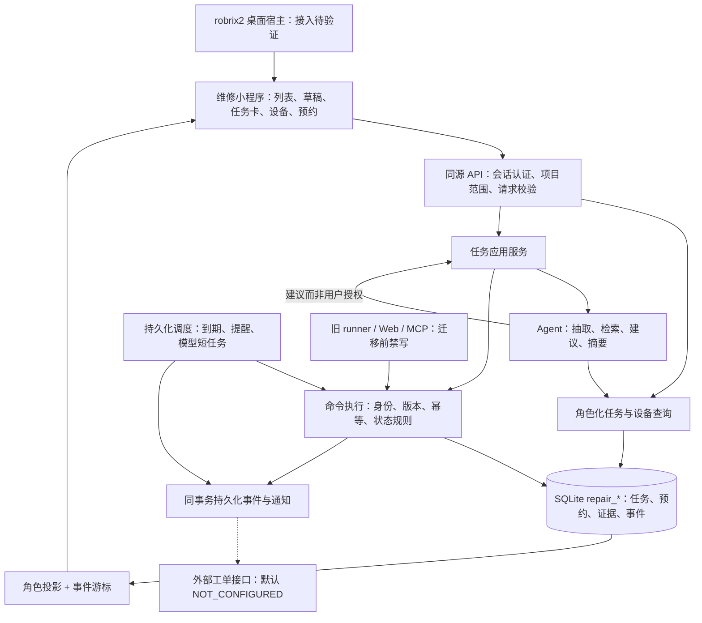

# 比赛版架构设计 v1

> **2026-09-27 Hub实证修订**：先读[13提交规范与架构差异](13_APP_HUB_SUBMISSION_REVIEW.md)。Hub版优先验证`main.splash`脚本应用；旧Rust broker＋本机Python配对不能作为可安装路线。保留业务规则与UI视觉；任务权威、身份、模型和持久化须G0裁决，未批准公网部署或降低多人验收。下文涉及旧宿主实现的内容仅作历史/条件设计。

> **研讨课 #1 后续修订（设计v1.2）**：先读[逐字稿与基线差异](11_COURSE1_BASELINE_REVIEW.md)。原robrix2为唯一P0宿主的前提已撤回，改以OctoSense原生持久应用为主选，App Card为意图视图；旧宿主/配对实现仍属条件设计。以下领域规则继续保留，宿主专属细节须G0复核。

日期：2026-09-22。本文描述目标，不声明已有实现。业务口径见 [需求](01_REQUIREMENTS.md)，字段及动作以 [接口设计](04_DATA_API.md) 为准。

2026-09-26增加[Agent运行分层](07_REVISION_20260926.md)与[独立核验协议](09_AGENT_HARNESS.md)：application拟新增agent_runtime.py、scoped_queries.py、intent_compiler.py、result_verifier.py。业务事务、任务权威、预约规则不变。旧事件日志仅复用为会话记录，不替代repair事务事件；Web端缩到必要回归与配对管理。

## 1. 架构决策

采用“桌面宿主入口 + 模块化后端 + 本地维修任务事实库 + 可禁用的外部工单适配器”。长期仍支持接入现有系统；本轮本地报单、接单、设备绑定、预约与进度必须真实保存和执行。

本轮不让新任务与旧 work_order 双主写入。旧 ops 表作为迁移基线和演示历史来源；新任务写 `repair_*` 表。关联旧记录需带 `source_system=legacy_seed`，不可因为本地任务提交就同时调用旧 create_workorder 再建一张单。

|决定|理由|代价与后续处理|
|---|---|---|
|本地维修任务 P0 为权威|外部系统只预留也能验收完整业务|未来按项目迁移数据权威，不能简单打开双写开关|
|单进程模块化后端|复用现有 Python 能力，减少赛事接入变量|长任务必须短事务与异步调度；并发测量后再拆进程|
|独立 task_contracts v1|保护迁移的旧契约与测试|需要 legacy_adapter 显式做枚举/字段映射|
|命令执行器统一写入|避免 UI/runner/MCP/后台出现不同规则|必须逐一收敛旧写路径，不能只加新 API|
|预约单独建模|提议、确认、拒绝、改约不同于任务进度|需要同任务和同技工两类并发保护|
|任务投影服务端生成|角色权限、动作可用性、状态来自同一处|前端不能自行推导成功或仅靠隐藏按钮鉴权|
|外部同步状态独立|本地完成不等于外部写入|未来连接器必须支持回执、核对和版本映射|

## 2. 架构图

可视版：[完整架构图册](ARCHITECTURE.html)。独立图：[系统](diagrams/system.svg)、[业务状态](diagrams/workflow.svg)、[执行时序](diagrams/execution.svg)、[部署](diagrams/deployment.svg)。每张图同名 `.mmd` 为可编辑 Mermaid 源码。下图是总览，详细字段看第 4 份文档。



## 3. 模块与代码放置

路径是拟新增路径，当前不存在不代表故障。保留现有 `ops/contracts`、`ops/data`、`llm` 等基线模块。

```text
backend/src/wagent_backend/
  task_contracts/              # v1 DTO、命令/状态枚举、错误信封
  application/
    identity.py               # 可信会话、项目授权、system能力白名单
    tasks.py                  # 报单、分配、设备绑定、完工验收
    appointments.py           # 提议、确认、改约与资源冲突
    execution.py              # 命令分派、版本、幂等、事务边界
    projections.py            # 卡片、列表、角色动作、来源脱敏
    agent_service.py          # 原Agent复用、只读工具、建议校验
    jobs.py                   # 数据库领取、租约、重试、到期守卫
    notifications.py          # 本地站内通知；不冒充外部发送
    legacy_adapter.py         # 旧枚举/工具名到新动作；无上下文拒写
  repair_data/
    repository.py             # 新表读写，不自行commit
    unit_of_work.py           # SQLite事务/连接生命周期
    migrations/               # 有版本的增量SQL，校验和固定
    seed.py                   # 明确标示来源的比赛数据
  integrations/
    workorders.py             # DisabledConnector及未来端口定义
  web/routes_tasks.py          # /api/tasks/v1；只转换协议
  web/routes_identity.py       # 本地演示会话
  web/static/repair/           # 新前端构建产物，不覆盖旧ops.html
frontend/repair/               # 仅Web回归：TypeScript + Vite + DOM/CSS
integrations/octosense/        # 原生维修app.card、Rust桥接、宿主分支/补丁和打包说明
runtime/                      # repair.db、附件、会话、日志，均不入库
```

### 模块依赖与禁区

- 路由、Agent、宿主桥接不得直接写 SQLite。repository 不提交/回滚外层事务；execution 统一负责。
- 命令层不能依赖宿主控件、SSE连接或模型供应商；断开界面后已提交任务继续存在。
- 后端查询授权在 SQL/检索前限定范围，返回后做字段脱敏；不能先把全项目资料送入模型再过滤回答。
- 图谱保留为辅助查询。旧图谱编辑、抽取写入、reset 在比赛模式默认不挂载；以后开放也须受同一身份和受控命令边界约束。本轮不全面改写 GraphRAG。
- 模型输出不产生可信用户身份，不绕过状态机。调度器也必须走限定类型的 SYSTEM 命令，不能获得任意管理员能力。

## 4. 任务状态机与主要守卫

|当前|动作|目标|必须成立|
|---|---|---|---|
|DRAFT|update_draft|DRAFT|本人草稿，字段合法；版本加一|
|DRAFT|submit_report|OPEN|地点/问题/症状/联系人完整；用户明确提交|
|OPEN|accept_task / assign_task|ACCEPTED|未有承接者；角色/项目/技能匹配|
|ACCEPTED|propose_appointment|ACCEPTED|当前承接者；生成有效提议|
|ACCEPTED|confirm_appointment|SCHEDULED|报修人确认；时段未过期且无冲突|
|SCHEDULED|propose_appointment|SCHEDULED|原确认预约仍保留，等待新确认|
|SCHEDULED|confirm_appointment|SCHEDULED|事务内替换旧确认预约，不双重占用|
|ACCEPTED/SCHEDULED|assign_task|ACCEPTED|经理改派且未开工；取消旧预约|
|SCHEDULED|start_work|IN_PROGRESS|当前技工、主设备已绑定、有效预约区间内|
|IN_PROGRESS|add_progress|IN_PROGRESS|当前技工、记录有内容|
|IN_PROGRESS|submit_completion|AWAITING_ACCEPTANCE|处置与至少一份有效证据附件|
|AWAITING_ACCEPTANCE|accept_completion|COMPLETED|报修人或有理由的经理|
|AWAITING_ACCEPTANCE|reject_completion|IN_PROGRESS|同上，拒绝理由必填|
|允许终止的非终态|cancel_task|CANCELLED|按需求权限表；释放预约、废弃未执行提议|

`bind_asset` 在 DRAFT/ACCEPTED/SCHEDULED/IN_PROGRESS 按需求角色约束执行，仅修改绑定不偷改阶段；IN_PROGRESS 必须经理并提供理由。OPEN 绑定由经理完成，技工先接单再绑定。预约拒绝/到期只改预约，任务保持 ACCEPTED 或 SCHEDULED。

COMPLETED/CANCELLED 是 P0 终态，不通过旧接口回写。退回维修保留全部历史；新故障建立新任务。

## 5. 本地事务算法

1. 认证，取得可信 actor、project grants、request_id。查询任务时必须验证项目范围。
2. 对请求做结构校验和 canonical JSON 摘要；幂等范围为 `(org_id, actor_id, idempotency_key)`，摘要包含路径、动作类型、task_id、预期版本、payload。
3. `BEGIN IMMEDIATE`；在事务内再次检查幂等记录。相同键同摘要返回已保存结果；相同键不同摘要返回 409 IDEMPOTENCY_CONFLICT。
4. 校验当前任务版本、状态、角色、设备有效性与预约冲突。不能仅依赖事务外读取的状态。
5. 完成全部本地写入：任务/预约/证据引用、任务版本+1、单调事件序号、动作回执、必要通知/outbox，在同事务提交。
6. 提交后返回回执和最新投影引用。SSE唤醒发生在提交之后；唤醒失败不回滚已提交业务，客户端回读可恢复。

禁止在 SQLite 写事务里请求模型、上传外部文件、调用外部 HTTP 或等待用户。错误不能留下部分预约、半张任务或已经写入但缺少回执的本地动作。

无任务聚合的身份/收藏/通知命令有自己的事务，不增加 task.version。UI业务命令成功均增加task.version，哪怕只是新增进度；前端据回执更新版本。拒绝/失败不改变任务版本。

## 6. 后台任务与事件

- `repair_jobs` 保存类型、对象ID、对象版本、due_at、尝试次数、租约到期。领取时短事务检查租约；进程崩溃后可重新领取。
- 任务类型固定为 RUN_AGENT、EXPIRE_APPOINTMENT、REMIND_APPOINTMENT、REMIND_ACCEPTANCE、DISPATCH_NOTIFICATION；本轮 EXTERNAL_EXPORT 不投递真实系统。
- 到期任务核验预约ID、版本、状态；已改约/已开工/已完成的旧作业不得再次改状态。SYSTEM身份只允许这些具体动作。
- 提议过期即使定时器延迟，也由确认命令实时拒绝，不能把正确性押在调度及时执行上。
- 每个业务事件在库中持久化；SSE只是通知通道。流只返回当前角色可见任务ID和事件游标，不广播敏感原始负载。
- 站内通知唯一键 `(event_id, recipient_id, kind)` 防止重复提醒；读/未读属于用户，不影响业务阶段。
- 提醒引用创建该预约或完工记录的原业务事件，不为同一task.version再插入事件。到期命令确实改变预约时，任务version加一并生成新事件；纯提醒、通知送达和已读不增加任务版本。
- 模型作业可重试读与建议，重复运行不得重复报单或接单；业务命令只依赖用户确认后的幂等请求。

## 7. Agent 运行协议

模型运行输入包含 actor可见的任务快照、task.version、允许的只读能力与任务目标；使用工具获得设备候选、有效服务关系、历史任务与允许查看的预约信息。输出是结构化建议、证据、缺失字段和可选建议命令。

建议携带 `base_task_version`；执行仍要由授权用户触发。新事件导致版本变化时建议标为过期并重新生成。即使模型输出了错误状态或虚假工具回执，也不得写到任务投影。

首期复用现有模型客户端、流组装和事件日志；原 runner 的“必须建单”提醒不适用于草稿辅助阶段，需通过新 agent_service 显式停用/隔离，而非改旧契约。旧业务工具通过受限 wrapper 映射到新查询/命令。

规则承担：状态校验、角色/技能、重复请求、时段冲突、到期、验收。模型承担：语义提取、候选解释、带来源的历史归纳、下一步建议。无模型时人工操作仍可完成，但真实模型验收单独标失败。

## 8. 外部工单接口和长期迁移

端口是自有设计，不是某个工单系统已存在API：`export_task(snapshot, correlation_id, idempotency_key)`、`get_export_result(correlation_id)`。DisabledConnector 返回 NOT_CONFIGURED 且不进行网络调用。测试假的接收端可以验证契约，只能记为“契约测试通过”。

未来开启时：每个项目显式选择适配器，配置版本和凭据，确定本地任务与外部工单映射；事件写入本地outbox，再由投递器调用，保留PENDING/SUCCEEDED/FAILED/UNKNOWN。外部成功以对方回执及回读为准。默认不做失败自动重复建单。

从 LOCAL 迁到 EXTERNAL 的步骤：冻结新写入口 → 对账并建立映射 → 确定历史任务归属 → 回读比较 → 切换单一权威 → 开放入口；不能两个系统同时改同一阶段。本轮数据库不接受EXTERNAL运行模式，避免预留字段被误认为能力已实现。

## 9. 旧能力兼容改造

|当前位置|问题|修改方式|验证|
|---|---|---|---|
|ops/tools/registry.py|每次工具调用自行commit|新增无事务提交的内部分派，旧入口通过兼容包装；新执行器独占事务|失败注入不能部分写入；旧测试继续运行|
|ops/agent/runner.py|工具调用及判责事件存在直接写入|业务写统一转legacy_adapter；新agent_service不触发旧自动建单提示|直接工具、后置判责、重试都经过边界|
|web/routes_ops.py|人工派单/责任调整直接repo写入|比赛模式禁用旧写路由；迁移后调用统一命令|旧URL不能绕过身份/版本/状态|
|ops/tools/mcp.py|裸写工具、自建连接、可传场景时间|比赛模式不启动旧写MCP；新受控工具要求服务器执行上下文|无上下文拒写，模型不能覆盖时钟|
|graphRAG与reset路由|额外数据副作用|比赛应用入口不挂载相关写路由，旧模式只用于本机回归|暴露路由清单核对|
|ops/data种子|数据来源与新任务混用风险|显式导入新repair_*目录，保留source_ref；旧数据库不被新流程更新|新旧数据分离、来源可追溯|

## 10. 未决项与不影响编码的部分

- 官方宿主具体版本、桥接、CSP/网络/权限支持必须过 G0。此前后端、状态机、接口、Web回归界面可独立实现；不可据此宣称宿主接入完成。
- 真实模型供应商配置由运行环境提供；接口保持当前兼容协议，不把个人Codex账号登录会话作为产品服务依赖。开发工作遵循Router约定。
- 本包完成的是设计、参考契约与验收计划。源码实现、生产认证、官方宿主运行、真实设备/外部工单联调均需要后续证据。
