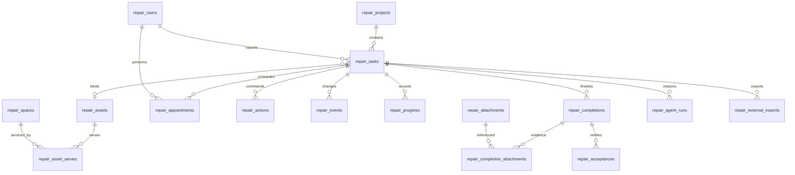

# 数据、命令与接口契约 v1

> **2026-09-27 Hub实证修订**：先读[13提交规范与架构差异](13_APP_HUB_SUBMISSION_REVIEW.md)。Hub版优先验证`main.splash`脚本应用；旧Rust broker＋本机Python配对不能作为可安装路线。保留业务规则与UI视觉；任务权威、身份、模型和持久化须G0裁决，未批准公网部署或降低多人验收。下文涉及旧宿主实现的内容仅作历史/条件设计。

> **研讨课 #1 后续修订（设计v1.2）**：先读[逐字稿与基线差异](11_COURSE1_BASELINE_REVIEW.md)。原robrix2为唯一P0宿主的前提已撤回，改以OctoSense原生持久应用为主选，App Card为意图视图；旧宿主/配对实现仍属条件设计。以下领域规则继续保留，宿主专属细节须G0复核。

日期：2026-09-22。**以下全部是本系统拟实现协议，不是 OctoSense 官方 API。** 机器可读接口为 [openapi.json](openapi.json)，参考建表为 [schema.sql](schema.sql)。参考SQL必须经版本迁移代码执行，不能直接覆盖旧数据库。

2026-09-26补充：[IntentSpec与Verifier](09_AGENT_HARNESS.md)为内部机制，复用agent_runs.result_json，公开返回沿用现有AgentRun字段；不直接透出额外内部字段，不新增未声明的业务写接口。动作核验依赖action_id、动作版本和事件的关键前后值，再读取最新投影，不能因后续版本推进而误判旧动作失败。

## 1. 共同约定

- 路由前缀 `/api/tasks/v1`；JSON字段snake_case，枚举大写；ID为不透明字符串（应用生成UUID），不可从ID推导权限。
- 业务时间全部UTC毫秒整数（`*_at_ms`）；界面显示Asia/Shanghai。API参数不允许设置业务当前时间。
- 原生使用broker持有的Bearer会话；Web使用HttpOnly会话cookie。后端根据会话取得actor与项目授权，不接受调用方伪造角色。
- Cookie写请求额外校验X-CSRF-Token及Origin；原生Bearer不依赖浏览器cookie。所有接口默认拒绝匿名，只有登录与配对发起/轮询使用各自限定机制。
- 创建草稿与任务动作必须带 `Idempotency-Key`（16–128字符，客户端生成并在同次重试复用）。同key不同请求返回409，不生成新动作。
- 同一任务的业务写入必须带 `expected_version`；首次创建版本1，成功命令+1；拒绝不变。前端不能把版本冲突当作网络重试自动覆盖。
- 每次成功任务动作产生一个主业务事件；事件的全局 `seq` 用于流恢复，task.version用于并发控制，不是同一个编号。
- 输入中未声明字段拒绝；自由文字字段有长度上限。名称、摘要、附件原名必须转义输出，不执行任何脚本。

## 2. 核心数据关系



|表组|事实与必要字段|约束|
|---|---|---|
|projects/users/roles/skills|组织、项目、用户、角色、技工技能|业务楼宇租户不是平台账号；角色按项目|
|spaces/assets/asset_serves|编码、来源、有效性、安装与服务关系|设备与空间必须同项目；asset_code项目内唯一|
|tasks|task_no、reporter_id、assignee_id、asset_id、space_id、status、version、原文/摘要、联系信息、时间偏好|本轮authority_mode只有LOCAL；外部默认NOT_CONFIGURED|
|appointments|task_id、technician_id、起止、状态、version、提议者、确认者、有效期|同任务最多一个PROPOSED及一个CONFIRMED；确认预约不能重叠|
|actions|actor、幂等key、请求摘要、预期版本、结果/错误JSON|org+actor+key唯一；创建草稿也留回执|
|progress/completions/acceptances|作者、内容、时间、验收结果|完工与验收分离；多轮退回有多份完工记录|
|attachments/completion_attachments|任务归属、sha256、大小、类型、路径键、上传者、引用|不同任务证据不可串用；下载先鉴权|
|events/notifications/jobs|事件seq、任务version、收件人、计划执行时间、租约、尝试次数|通知去重；作业领取/完成不能重复业务动作|
|pins|user_id、task_id、创建时间|属于用户，不改任务版本|
|agent_runs|输入任务版本、模型/提示版本、状态、结构化结果、错误、用量|模型输出不更新任务事实|
|external_exports|task_id、输出版本、状态、外部单号、回执、相关ID|禁用连接器无网络调用，不伪造external_id|
|auth_sessions/host_pairings/host_sessions|哈希凭据、有效期、主体/实例、撤销时间|不持久化明文密码/token，日志不记录敏感凭据|

参考SQL承担外键、唯一、基本check和预约重叠防线。角色权限、技能、附件真实性、任务状态守卫仍在应用层验证；不能把SQL可执行误称完整业务实现。

## 3. HTTP接口目录

|方法与路径|用途|写入边界|
|---|---|---|
|POST /auth/login|Web演示账号登录，设置cookie与CSRF|身份服务，限速，失败不泄露账号存在性|
|POST /auth/logout|注销当前cookie会话|撤销服务端会话|
|GET /me|当前可信用户、项目角色、CSRF（仅Web）|只读；不返回其他账号|
|POST /host/pairings|原生broker发起短期本地配对|匿名但限loopback、限速、app_id允许名单|
|POST /host/pairings/{id}/approve|Web登录用户确认本次配对|cookie+CSRF；绑定当前主体，不能填写别人的user_id|
|POST /host/pairings/{id}/poll|broker持配对秘密获取状态/一次性会话|校验poll_secret，非普通业务Bearer|
|POST /host/session/revoke|原生关闭/退出撤销会话|当前hostBearer|
|GET /projects|当前用户可访问项目|只读|
|GET /projects/{project_id}/spaces|可选服务空间|项目授权过滤|
|GET /projects/{project_id}/technicians|可分配技工及技能|经理可见；不公开其他任务安排|
|GET /assets?project_id=&q=|编码、名称、二维码载荷查询|项目授权过滤，返回来源|
|GET /assets/{asset_id}|设备身份详情及服务空间|同上|
|POST /tasks|创建DRAFT，返回任务投影|内部create_draft命令，幂等|
|GET /tasks?project_id=&view=&cursor=|角色化分页列表|view为mine/open/assigned/project；服务器核验|
|GET /tasks/{task_id}|完整当前角色任务投影|无权按404返回，避免枚举|
|POST /tasks/{task_id}/commands|执行下面的命令枚举|唯一公开业务写入口|
|POST /tasks/{task_id}/attachments|上传证据，返回attachment_id|鉴权/类型/大小检查，附件服务事务，不改任务版本|
|GET /attachments/{attachment_id}|授权下载|禁止通过storage_key直接静态访问|
|PUT /tasks/{task_id}/pin|设置自己的收藏布尔值|独立用户事务，不改任务版本|
|POST /tasks/{task_id}/agent-runs|启动有限模型运行|持久化作业，不直接写业务状态|
|GET /agent-runs/{run_id}|模型结果/失败|校验关联任务当前权限|
|GET /events?after_seq=|SSE变更流|只输出可见任务ID与游标；不广播原始内容|
|GET /notifications|当前用户通知|按收件人隔离|
|POST /notifications/{notification_id}/read|标记已读|仅本人；重复请求无新增记录|

上表路径都相对共同前缀。接口发布后由FastAPI生成实际OpenAPI，与参考openapi.json做契约比较；不能静默改路径后只更新前端。

## 4. 任务命令表

共同信封：`{type, expected_version, payload}`。可信actor来自会话。每条命令的schema必须封闭字段。

|type|payload|关键守卫|
|---|---|---|
|update_draft|raw_text? summary? space_id? symptom? contact_name? contact_detail? requested_start_ms? requested_end_ms?|本人DRAFT；至少一个字段；显式null可清空可选字段；成对时间要么都空要么start<end|
|submit_report|空对象|本人DRAFT；必填信息完整；OPEN|
|accept_task|空对象|当前技工自主承接OPEN；不能指定另一个人|
|assign_task|technician_id, reason|经理；OPEN/ACCEPTED/SCHEDULED；改派释放旧预约|
|bind_asset|asset_id, evidence_kind, reason|project/服务关系/active校验；权限与状态见需求|
|propose_appointment|start_at_ms,end_at_ms,note?|当前承接者或经理；生成提议，不自动确认|
|confirm_appointment|appointment_id|本人报修人；当前PROPOSED；时效/版本/技工资源校验|
|reject_appointment|appointment_id,reason|本人报修人；当前PROPOSED；过期提议不能拒绝成有效操作|
|start_work|空对象|承接技工；SCHEDULED；设备/当前预约满足要求|
|add_progress|kind,note,attachment_ids?|承接技工IN_PROGRESS；附件全部归当前任务|
|submit_completion|resolution,actual_root_cause,attachment_ids|承接技工IN_PROGRESS；根因可UNKNOWN；至少一个附件|
|accept_completion|completion_id,note?|报修人或经理；经理note必须非空；验收最新待验收完工|
|reject_completion|completion_id,reason|同上；回IN_PROGRESS；保留旧完工|
|cancel_task|reason|需求中允许角色/阶段；取消预约及未执行提议|

内部命令 create_draft、expire_appointment、create_notification 等不作为可随意填写的外部 type 暴露。每个路由内部仍经过受控服务与事务。

验收和退回的操作者必须不同于当前assignee_id，即使同时具有REPORTER或MANAGER角色也不能自验；该跨字段约束在执行器中检查，JSON schema本身不能证明成立。

### 示例：确认预约

```http
POST /api/tasks/v1/tasks/tsk_example/commands
Idempotency-Key: 38ccfcb9-c0fa-4fa7-a235-7aa1687bcf6e
Authorization: Bearer <host-session-token-held-by-broker>
Content-Type: application/json

{"type":"confirm_appointment","expected_version":5,"payload":{"appointment_id":"apt_example"}}
```

```json
{"action_id":"act_example","status":"SUCCEEDED","task_id":"tsk_example","task_version":6,"event_seq":23,"projection_url":"/api/tasks/v1/tasks/tsk_example"}
```

这里的ID/版本是协议示例，不是真实业务结果。同键重试返回同一action_id和原回执；随后GET可能返回更高版本，前端只接受不倒退的最新投影。

## 5. 任务投影

投影包含 task_id/task_no/project_id/status/version、报修内容、设备摘要与来源、承接者摘要、当前确认预约及待确认提议、最近事件、最新完工及验收、external_sync_state、外部单号（未接入为null）、allowed_actions、next_actor、server_time_ms、last_event_seq。

`allowed_actions` 由后端实时计算。每项包括 type/enabled/disabled_reason；禁用原因面向用户，比如“请先确认设备”“预约已过期”，不能泄漏其他项目数据。它是UI提示，不替代执行时校验。

数据脱敏：未接单技工只看匹配任务的概要，contact_detail为空；自己承接后才可读必要联系信息。跨项目不可见任务不进入列表/事件/模型检索。分享task_id不改变权限。

## 6. 原生本地配对契约（自有，非官方身份API）

为P0同机演示定义最小可实现的显式配对，不假设已有Matrix OpenID或远端OAuth：

1. broker调用POST /host/pairings，提交 app_id、app_digest、instance_id、display_name。服务端校验允许名单与loopback来源，生成pairing_id、8位user_code和256位poll_secret；只存两者哈希；120秒过期。
2. 后端返回配对ID/用户码/轮询秘密。broker显示用户码；用户打开已登录的本地Web“宿主配对”页，核对实例名称/码并提交approve。该操作绑定的是当前Web用户，不接受请求中的user_id。实例名称/宿主自报账号是待核对标签，不是身份凭据。
3. approve检查会话、CSRF、user_code哈希、未使用/未过期；写approved_user_id。同一配对只能审批一次。
4. broker用POST poll提交poll_secret。PENDING只返回状态；APPROVED原子消费并生成最长15分钟的host_session_token，响应仅返回一次，数据库保存token哈希及user/instance/app绑定；ISSUED再次poll返回已领取不再次发token。丢失领取响应须重新配对，不生成第二个可用token。
5. broker只在本次宿主grant有效时调用后端；应用脚本看不到秘密。退出/关闭调用revoke，token失效。后端每次使用还检查用户有效性、项目权限和会话expiry/revoked。

配对接口默认只允许同机loopback，不允许将配对管理端公开到网络。它证明用户明确允许该本地实例代表某个演示账号，不证明软件供应链或远端设备身份。官方后续若提供可验证身份机制，按ADR替换；不要自行声明已完成企业认证。

## 7. 错误与重试

错误信封：`{error:{code,message,retryable,details},request_id}`。不得在message泄漏堆栈、密码、文件路径或其他用户数据。

|HTTP|code|客户端行为|
|---|---|---|
|401|UNAUTHENTICATED / SESSION_EXPIRED|重新登录/授权，不无限重试|
|403|FORBIDDEN|提示没有动作权限；不得隐藏失败当成功|
|404|NOT_FOUND|对象不存在或当前不可见|
|409|VERSION_CONFLICT|回读新投影，要求用户重新核对|
|409|ALREADY_ASSIGNED / SLOT_CONFLICT|刷新承接/预约状态，重新选择|
|409|IDEMPOTENCY_CONFLICT|新意图使用新键；排查复用错误|
|409|INVALID_STATE / DEVICE_REQUIRED|展示状态要求，不擅自补写前置动作|
|410|PROPOSAL_EXPIRED / PAIRING_EXPIRED|重新提议或配对|
|413/415|ATTACHMENT_TOO_LARGE / UNSUPPORTED_MEDIA|更换文件|
|422|VALIDATION_ERROR|保留输入并标明问题字段|
|429|RATE_LIMITED|按Retry-After有限重试|
|503|TEMPORARILY_UNAVAILABLE|本地未完成动作可同幂等键重试；真实模型失败不伪造结果|

幂等保存成功及确定的业务拒绝回执；请求语法/未认证失败不保存幂等记录。版本冲突后用户改方案必须使用新键。瞬时数据库忙或事务回滚返回503，不留下成功回执。

## 8. 外部预留输出

```json
{"schema_version":"1.0","correlation_id":"export_example","local_task_id":"tsk_example","local_task_version":8,"project_ref":"project_example","asset_ref":{"local_id":"asset_example","external_id":null},"operation":"UPSERT_REPAIR_TASK","snapshot":{"status":"IN_PROGRESS","summary":"示例问题","appointment":null},"occurred_at_ms":0}
```

occurred_at_ms=0仅为示例占位，实际必须服务端真实时间。字段映射/供应商URL/鉴权方法尚未约定，不创建猜测的外部endpoint。DisabledConnector返回 `{state:NOT_CONFIGURED,external_id:null}`，不调用网络、不写SUCCEEDED。未来API回应202仅代表受理，须核对对方最终结果才SUCCEEDED。

## 9. 参考SQL与迁移

schema.sql是新库的参考结构，不包含真实账号、密码、用户数据。实现时拆分为0001_initial等迁移并记录版本、校验和及备份恢复方法。旧库不得自动改名后冒充新库；设备/空间/历史种子通过显式导入映射。

文件对象不与SQLite天然原子：先写临时文件，校验后原子移动，提交元数据；进程崩溃可留下孤儿文件，维护作业核对并清理。未完成元数据的文件不可被下载或引用；所有下载检查数据库归属与权限。
