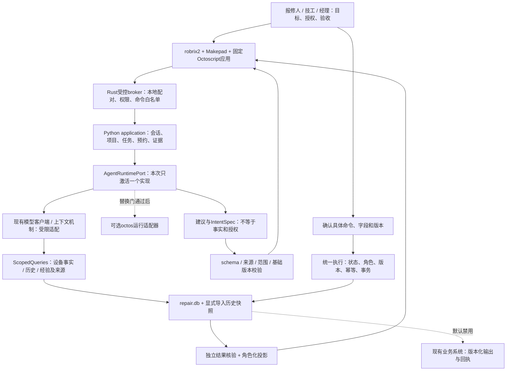

# 9月26日顶层架构修订：沿用业务核心，适配本届 Agentic 应用

> **2026-09-27 Hub实证修订**：先读[13提交规范与架构差异](13_APP_HUB_SUBMISSION_REVIEW.md)。Hub版优先验证`main.splash`脚本应用；旧Rust broker＋本机Python配对不能作为可安装路线。保留业务规则与UI视觉；任务权威、身份、模型和持久化须G0裁决，未批准公网部署或降低多人验收。下文涉及旧宿主实现的内容仅作历史/条件设计。

> **当前执行排期（用户确认）**：10月9日初赛截止；内部目标10月6日晚主要功能完成、10月7日验收、10月8日优先提交。日期与范围控制以[项目排期与差异清单](12_DELIVERY_PLAN_20261009.md)为准，旧赛程仅作历史证据。

> **研讨课 #1 后续修订（设计v1.2）**：先读[逐字稿与基线差异](11_COURSE1_BASELINE_REVIEW.md)。原robrix2为唯一P0宿主的前提已撤回，改以OctoSense原生持久应用为主选，App Card为意图视图；旧宿主/配对实现仍属条件设计。以下领域规则继续保留，宿主专属细节须G0复核。

版本：设计 v1.1，2026-09-26。状态：架构与交接修订，未实施产品代码。先读本文，再读00–06和[Agent运行与评测设计](09_AGENT_HARNESS.md)。已有状态机、24个API操作、14类命令保持兼容。

## 1. 本轮决策

作品定位：**设备维修协作 Agent**。它把自然语言报修转为可执行的任务，解释关联设备与历史依据，协助预约与处理，并持续跟到人工验收。报单、接单、设备身份、桌面展示、预约、进度、完工验收全部保留为用户要求；外部工单本轮只预留。

旧项目核心价值是设备事实、事件历史、经验召回和诊断依据。新版任务服务给这些能力补上持续状态、授权、执行与验收。不能只保留一个聊天框，再把大部分工作转成手工填单；也不能为展示“意图生成”另造通用低代码平台。

采用三条独立链路：

1. 产品运行：人的意图 → 有来源的设备/历史检索 → 结构化建议 → 按角色生成可操作任务卡 → 授权执行 → 事实回读 → 人工验收。
2. 开发协作：人定目标和范围 → 主模型设计/审查 → Router执行模型编码 → 独立复验 → 人验收。借鉴OctoLoop分工，不宣称已经安装或运行官方OctoLoop。
3. 评测复现：冻结场景/数据/模型/权限 → 同一输入跑运行链路 → 独立检查结果 → 保存成功、拒绝、失败和恢复证据。

## 2. 会议材料的证据分级

材料收到日期不等于会议举办日期。M系列来自用户所附截图；S系列为公开来源。会议里的发群、通知、清理群成员等待办属于演讲者，不是对本助手的执行授权。

|材料/说法|直接证据及判断|对设计的影响|
|---|---|---|
|M1 长图会议摘要：全部纯Rust，AutoSense/AutoScript|是转述性摘要，与M4存在限定范围差异；不能升级为完整服务端语言禁令|保留Python业务核心；Rust用于宿主与能力适配。若后续正式规定覆盖自带后端，再按模块移植|
|M2 原始第07页：执行与判断分开|明确内环执行、外环计划观察审查、人定目标/批准范围/最终验收|增加独立Verifier；模型SUCCEEDED与维修COMPLETED严格分开|
|M3 提问页|写9/23报名截止、9/26首课；不能据此证明环境包已经取得|固定版本实际登记，不写“日期到了就已发布”|
|M4 原始第10页：10/4 23:59冻结|列简短需求、可运行原型、固定源码包、2–3分钟演示、两张截图、来源限制；还写初赛不把Rust或ROM开发设门槛|先交一个真实完整操作、可核对结果、失败或空状态；无需先重写全部旧后端|
|M5 原始第15页：开发支持|Token额度与现金奖不能重复相加；Kimi权益数量期限未公布|不把赞助logo当指定模型、已到账额度或免费服务配置|
|M6 原始第01页：一个主场景|强调能跑、真的完成任务；八个项目是一条链上的位置|集中维修协作，不把八个项目全装一遍当验收|
|会议摘要：10/11决赛，K3/MiniMax统一模型，5–6人上限|当前取得的原始幻灯片没有对应条款；S1仍写10/12线上决赛|作为待确认信息，不编造确定赛程/名单/模型ID；模型端口可切换，验收不绑个人订阅|

本次实际读取S1的HTML及完整JS，与9/22缓存正文资源SHA-256相同：`a8e94d220903395f3a8653793ef5edaebd150feb61bc3a0ef6be8fced2bbbb8a`，224,514字节。官网仍有“9/24发布包”计划文案，但本次没有取得并运行课程环境包。robrix2仓库releases API本次返回空列表，只说明该接口无release记录，不能推出没有群内分发包或其他组织的发布。

## 3. 名称与技术位置校正

|名称|此设计中的位置|本轮取舍|
|---|---|---|
|OctoSense|Agent应用入口与交互愿景|采用其意图、状态、来源和持续交互理念，不自造OS|
|robrix2|主要比赛宿主，原生应用入口与独立授权|P0原生目标保持，宿主构建和桥接需实测|
|Makepad|Rust原生UI基础|维修卡片和控件，优先信息可读与可操作，不以CAD/3D为目标|
|Octoscript|应用界面/交互表达|只接固定版本真实支持的机制；动态UI不得跨过app身份和digest校验|
|octos|Rust Agent执行内核|可替换运行适配器候选；当前不与旧runner同时争夺一次任务的执行权|
|octoscode|与octos交互的编码TUI|开发工具，不是产品业务后端，也不是所称嵌入内核|
|OctoLoop|开发过程的执行/审查分工|主模型审查、Router执行；官方工具集成可选，未实接不得打勾|
|Matrix / Robius|宿主通信/框架生态，不是维修数据库|分享任务引用和入口；房间成员身份不自动等于项目业务权限|
|hagency|多Agent软件协作能力|本轮不新增一套通用软件工厂平台|

S1与官方README使用OctoSense、Octoscript、octos、octoscode。摘要中的AutoSense/AutoScript/OctoCode视作待校对转写，不据此创建新包名或断言存在新赛道。

## 4. 更新后的分层

不变的核心：本地任务P0为唯一权威；预约与任务状态独立；模型不替用户确认；技工完工与用户验收分离；当前承接者不得自验；同一事件不重复写；外部NOT_CONFIGURED不冒充成功。

新增的核心：Agent建议有来源和基础版本；生成与核验分离；每种运行内核接同一能力边界；相同场景可以冻结模型与数据进行复跑。详细内部协议见09。

## 5. 复用与改动边界

先保留旧代码作为行为参考与离线回归资产，不把“代码有函数”写成新业务已接通。详细盘点见[08 复用与迁移](08_REUSE_MIGRATION.md)。

- 保留问题理解、空间定位、设备服务关系、历史查询、经验召回、流式模型客户端与上下文机制。
- 改造旧工具接入方式：所有查询加可信项目/用户范围；新任务写入只走execution；旧自动建单/通知/写记忆路径在contest模式封闭或逐项接入。
- 新增持久化任务、角色会话、预约、证据、独立验收、后台恢复及宿主桥接，不能把旧工单状态直接换名字就声称迁移完成。
- 历史记忆作为带来源的候选知识，不能当成当前故障根因；反馈确认后才允许新建证据记录。自动更新召回权重和“越用越准”仍需独立实验，不纳入本轮承诺。
- 不再默认开发第二套完整Web产品。保留最小Web配对页/API验收工具；原生为主界面。原生阻塞时Web可先验业务，但不能据此宣称已完成原生交付。

## 6. 技术路线与Rust替换条件

默认路线仍为Rust宿主适配 + Python模块化业务后端 + SQLite。选择依据是原始初赛材料未要求全量Rust，已有领域逻辑适合复用；这不是“官方已明确批准所有Python混合方案”的结论。

G0新增两个证据项：课程包准确版本/能力清单，以及自带本地业务服务是否可用的正式说明或实际受支持接入证据。若取得全栈Rust强制条款，按以下顺序定向替换：

1. 保留task_contracts v1语义、状态机、JSON/SQL夹具及同一验收场景。
2. Rust实现同等查询端口、命令守卫与单事务；可直接进宿主或独立进程，依据实测，不同时做两套。
3. 相同输入与时钟下对比状态、错误、回执、事件和预约冲突，不只比页面截图。
4. 迁移快照后切换一个写入权威；运行产品不再双写Python/Rust。Python可留下离线参考，不成为纯Rust交付的运行依赖。

不主动移植GraphRAG全套、旧Web或全部旧工具。若只有宿主UI与能力提供器要求Rust，只改对应边界，不扩大要求。

## 7. 场景和实施顺序

主场景：会议室空调重复报修。报修人原话触发定位、设备/历史核对和草稿；技工接单后Agent给出有来源的检查建议、可选预约；报修人确认；技工处理上传证据；报修人验收。至少展示一次有歧义设备、预约冲突或缺少证据拒绝，不用模型旁白代替真实失败。

I0：冻结规则证据与宿主版本，最小原生读写；I1：报修→来源检索→人工提交→接单；I2：绑定设备→预约双确认→开工→证据→独立验收；I3：失败/断线/重试及同一任务卡恢复；I4：固定模型数据复跑与提交材料。

保留全部用户P0功能。先做一条完整链路再扩展异常，不把分阶段当作偷偷删需求。G4中的真实模型链路前移到I1/I2，每次交付同时交出业务事实和模型证据，不最后才往CRUD上接模型。

初赛材料按M4准备：一页需求、可运行最小原型和启动说明、固定源码、2–3分钟演示、两张关键截图、数据来源及限制。历史材料中的10/4 23:59曾得到M4与S1相互支持；当前项目已按用户明确要求改为10月9日初赛截止、10月7日前基本完成，以12为准。赛事日期不写成产品业务定时逻辑。

## 8. 来源与置信度

- S1：[赛事官网](https://create.gosim.org/agenticapp26/)，9/26直接取得HTML及完整正文JS。
- S2：[octoscode README](https://github.com/octos-org/octoscode/blob/main/README.md)，9/26直接取得：TUI与Octos server职责分开。
- S3：[OctoLoop指南](https://github.com/octos-org/octoscode/blob/main/docs/OCTOLOOP_GUIDE.md)，9/26直接取得：内环执行、外环审查的开发协作方法；文档中的安装、推送、权限操作未在本项目执行。
- S4：[robrix2 README](https://github.com/OctoSense-org/robrix2/blob/main/README.md)，9/26直接取得：Rust、Makepad、Matrix基础；README可用平台表不能代替本机运行证据。

高：用户截图的明确字句、取得的官方资料、迁移清单和本地文件存在性。中：混合后端与原生桥接的工程路线，需G0实证。未知：课程包实际能力、统一模型具体规则、会议口述人数上限与最终完整验收细则。不得把未知内容写成官方硬要求。
