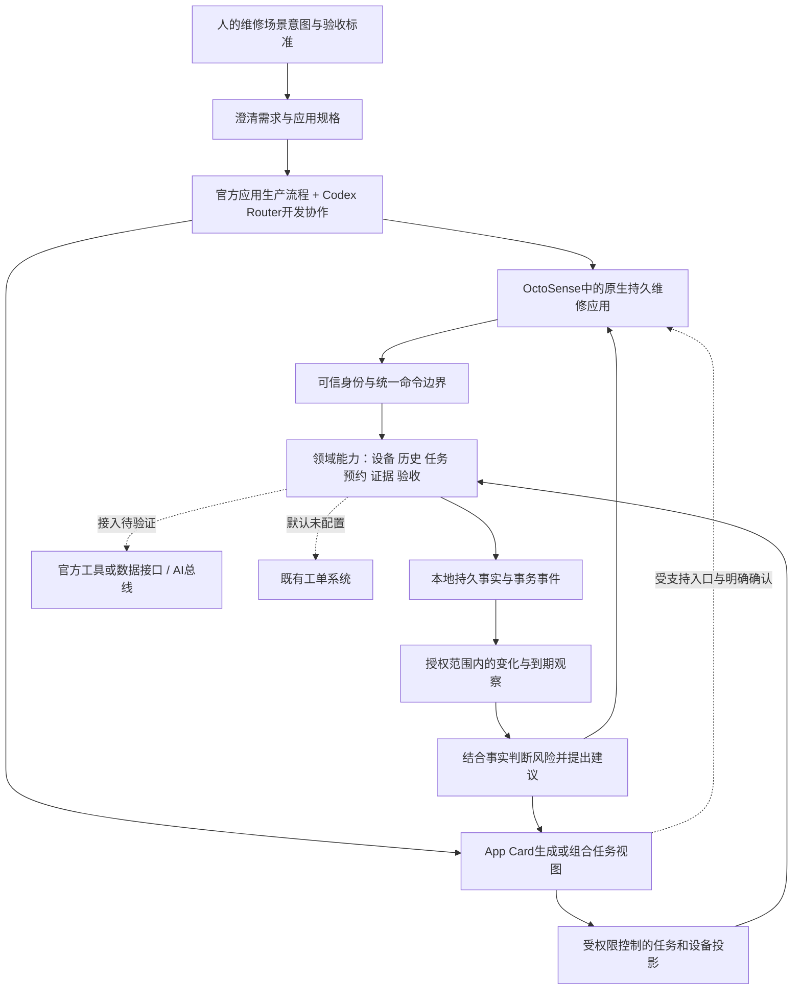

# 研讨课 #1：逐字稿核对与项目基线修订

> **2026-09-27 Hub实证修订**：先读[13提交规范与架构差异](13_APP_HUB_SUBMISSION_REVIEW.md)。Hub版优先验证`main.splash`脚本应用；旧Rust broker＋本机Python配对不能作为可安装路线。保留业务规则与UI视觉；任务权威、身份、模型和持久化须G0裁决，未批准公网部署或降低多人验收。下文涉及旧宿主实现的内容仅作历史/条件设计。

> **当前执行排期（用户确认）**：10月9日初赛截止；内部目标10月6日晚主要功能完成、10月7日验收、10月8日优先提交。日期与范围控制以[项目排期与差异清单](12_DELIVERY_PLAN_20261009.md)为准，旧赛程仅作历史证据。

日期：2026-09-26。版本：设计 v1.2。**本文件是本次会议之后的设计解释基准；与00–10中宿主、应用形态及实施顺序冲突时，以本文为准。业务协议未重写，产品代码未实施。**

来源：[腾讯会议《Agentic App 黑客松研讨课 #1》](https://meeting.tencent.com/crm/2kAd7Z94bd)。以下时间均为录像内相对时间，不是北京时间。

## 1. 读取范围与证据边界

实际打开了纪要与逐字稿页，按正向和反向滚动补齐虚拟列表，读取 **212段，段号0–211连续无缺项**；起始00:00，最后一段起始03:29:44。播放器元数据显示总时长约03:30:14。已阅读这些转写文字，没有逐秒听校音频，也没有逐帧识别屏幕中的代码、仓库地址或演示操作。

用户提供日期为2026-09-26 14:07:45，页面显示2026/09/26 13:12；本报告只确认日期，保留两个不同的时间记录，不擅自解释差异。转写中的AutoSense/auto science/Octo等不一致称呼，结合本项目已有来源采用OctoSense、octos、Octoscript等规范名称；新名称与具体仓库地址尚不能只凭语音转写冻结。

页面明确标注纪要由AI生成。其“初赛提交截止10月9日”的概括与原话存在差异，首次对照未直接据此定日期。用户随后明确要求按10月9日初赛截止执行，现按12排期；这不改写此前证据的歧义。页面不开放另存/下载，本轮使用可见逐字稿阅读形成分析，没有下载录像，也不在工程内复制完整转写。会议里的安装、发群、修改群名、发Token等均是课程内容，不是本项目此次已执行的事项。

**证据等级：** 高＝转写多处相互支持、语义明确；中＝依赖口述/演示上下文或未听校音频；未知＝没有具体版本、地址、字段或正式条款。设计推论单独注明，不能升级成官方硬要求。

## 2. 最重要的结论

**原有方案的业务核心可以保留，但“所有作品都必须以robrix2原生小程序为主入口”的前提需要撤回。** 本课首先围绕OctoSense整体环境，区分持久原生应用、App Card等应用形态；原robrix2所在的即时通信/小程序方向是其中一个方向，课程说明已经更名。自动转写出现Remix、rings等不同拼写，准确新名与仓库等待课程资料核对。

我们的新定位建议是：**在OctoSense中运行的设备维修协作原生应用，以设备事实和任务状态为基础，通过Agent提供主动跟进，并按用户意图生成任务摘要/操作视图。** 原生持久应用负责长期数据和业务动作；App Card负责组合展示与入口。卡片重新生成不能创建第二份任务、复制权限或绕过确认。

这是根据课程作出的项目设计选择，置信度中；不是讲师为本项目指定的架构。跨应用总线和第三方业务服务能否直接接入，仍需选定版本实测。

## 3. 会议证据索引

下表为概括，不是逐字引用；时间可用于回到录像核对。

|时间|会议可支持的内容|对本项目的含义|置信度|
|---|---|---|---|
|00:00–05:03|可选择官方或自定义场景；强调意图理解、规格整理、生产流程和应用产物|维修场景可以继续；补应用生成/改进的过程证据，不能仅展示已写好的表单|高|
|04:05–05:03、20:15|初赛可使用自己的模型；决赛强调公平模型条件；初赛先提供MiniMax资源|开发Router与产品模型分开配置；决赛具体模型ID、额度和规则仍待正式清单|初赛高，决赛具体配置未知|
|09:40–16:54|生态以Rust、Makepad、Octoscript和octos为基础；外环规划审查、内环实施|主交付按原生生态验证；现有Python可复用边界尚未得到明确批准|高/边界未知|
|24:52|提交作品有CI和AI基础核验，通过才算成功；未通过可在截止前修正|交付终点增加官方提交回执，不以上传源码或本地测试通过代替|中，仓库/流程文件未取得|
|01:19:21–01:26:10|OctoSense是整体环境；原robrix2方向更名；即时通信方向可有网页小程序与Agent服务|撤销robrix2为全部应用唯一宿主的推论；不把该方向的Web方案套到所有原生应用|高；新名称中|
|01:23:53|要有真实输入、执行、可检验结果和失败状态；静态概念稿不足|四版HTML只是设计参考，业务必须持久化并回读结果|高|
|01:26:37–01:29:06|本地桌面可用；手机不是通用加分门槛；建议初赛先完成选定场景MVP|先做桌面闭环，移动端/刷机不成为当前阻塞项|高|
|01:34:38–01:42:09|讲解进程应用、链接模块等形态；作品版权属于参赛者且需开源|把应用载体与领域后端分开；具体许可仍需正式提交规则|高|
|01:53:20、03:12:20|Makepad调试可借助Studio获取信息并核验；演示中也有可用性问题|增加原生实际点击与视觉检查；HTML浏览器检查不能替代|中，实际工具能力待版本核验|
|01:58:34、02:04:41–02:06:09|界面美观与生成质量值得优化；当场App Card有不能点击、未保存记录等限制|动态卡片不能直接被假设为完整业务UI或持久存储|高，限于当场演示|
|02:32:04–02:44:22|Octoscript面向生成和渲染；App Card是容器；持久进程应用可提供数据给卡片|区分应用生成、临时视图、持久任务；不自造替代官方语言的通用DSL|高|
|02:46:48–02:50:45|邮箱未接通时不能把虚构数据当成已读取数据|演示合成数据须标来源；外部工单未接通保持NOT_CONFIGURED|高|
|02:55:17–02:59:42|原生应用与App Card可结合；AI总线属于设计/生态目标，当前卡片读取还有固定接口/目录限制|工具/数据提供器先抽象为端口；不能承诺总线和任意跨应用调用已可用|高|
|03:00:34–03:04:50|主动观察变化、判断风险、提出方案比被动查数据更Agentic；跨应用可体现技术价值|增加一个维修主动跟进场景，先做可验证的最小触发闭环|高；项目方案为推论|
|03:13:28、03:20:24–03:23:23|先跑基础应用，再深化场景；演示蓝图含理解计划、真实数据、确认、执行与持续跟进|原有独立验收与执行守卫保留；应用生成和后续运行各自验收|高|

“Rust编译通过”在03:08:17也被限定到类型等代码检查，不等于业务规则正确，不能删除业务测试。

## 4. 与现有基线的差异及处理

|项|当前文档/实现|本次修订|怎么改、何时验证|
|---|---|---|---|
|宿主前提|00/02/03/06等把robrix2作为唯一P0宿主|**撤回唯一宿主前提**。主选OctoSense原生持久应用；即时通信方向为可选接入|取得本课仓库清单，原生示例编译运行后冻结app入口和版本|
|应用形态|任务卡、固定小程序、原生应用混用|分为持久维修应用、意图驱动App Card、可选通信分享三个职责|同一task_id跨视图读回，不重复建单；卡片不存第二份业务事实|
|比赛展示|主要证明维修操作闭环|同时证明“意图/需求→应用产物”与“应用→真实任务结果”|交出输入需求、生成规格、产物版本、构建/交互证据和数据库回执|
|固定UI|10及四版稿侧重固定列表/表单|固定业务组件作稳定基础；Agent根据角色/任务/意图选择展示内容与动作入口|先做受限组合和官方生成机制试验；仅换文案不能称为生成应用|
|Agent行为|抽取、查历史、提出建议，以用户主动发起为主|新增一条主动跟进：观察任务/预约变化→解释风险→建议下一步|先做本地持久事件/到期触发；需要写操作时仍由用户确认|
|技术栈|Rust broker + Python/FastAPI/SQLite默认冻结|原生Rust/Makepad目标强化；Python为**有条件的复用候选**，不宣称官方批准|G0测试一个受支持的调用与本地持久化；不成立时只移植必要领域模块|
|宿主授权|照固定文章编辑器设计grant、本地配对及Matrix相关边界|原有身份/权限原则保留，具体宿主票据和配对方式不再当通用官方实现|官方宿主接口确认后更新03/04；旧配对端点现为条件设计，暂缓编码|
|设备与维修|空间、设备关系、历史、经验、报单/接单/预约/进度/验收|**保留**；仍是作品业务价值与用户明确需求|按08迁移；事实和建议、技工完工和报修人验收分开|
|AI总线|设计图容易被理解为已具备跨应用能力|标为待验证生态接口，先做只读任务投影提供器|记录权限、来源、更新时间；未接总线不显示已共享成功|
|开发协作|Codex Router分工，借鉴OctoLoop|继续Router；官方OctoLoop是可选工作机制，不能以名字替代可复现证据|记录规划、实现、独立核验产物；主会话路由不明时如实标注|
|官方提交|源码、启动说明、录屏和截图|新增指定仓库/CI反馈与通过回执的核验项|拿到实际schema/workflow后对齐；本轮不自动提交或开源发布|
|完成判据|设计校验、旧后端测试、HTML交互检查|这些只证明各自范围；另验原生运行、真实模型、数据写入、主动触发、官方提交|分别保存证据，不合并为一个“已完成”|

当前重新检查：79个迁移文件、3,591,754字节与迁移清单一致。课程修订没有改变旧代码，也没有实现新任务服务。

## 5. 修订后的架构方向

图中为目标职责，并非已接通组件。Python/Rust领域实现二选一由G0决定，不双写。App Card在选定版本不能承载可信操作时，只提供摘要和跳转原生应用；不能执行就明确显示只读。

区分三个层次：

1. **应用生产过程**：人的意图→规格→生成/修改原生应用→编译→实际交互核验。保留固定输入与产物版本，使同一约束能复跑。
2. **应用运行过程**：报修原话→来源检索→建议→明确命令确认→事务写入→结果回读→人工验收。持久事实不由生成界面或聊天文本决定。
3. **临时视图生成**：依据当前角色、可见任务和查询意图生成/组合展示。可变的是视图和建议，任务ID、授权和业务守卫保持稳定。

不要求比赛版自己重造通用软件工厂。选一个维修场景，展示官方流程在该场景下如何产出可运行应用，以及我们如何改善数据约束、交互和核验质量即可。课程强调生产流程，不足以推出“每次报修必须重新编译一个应用”。

## 6. 适合本项目的最小展示闭环

以下为本项目建议，不是赛方指定脚本。保留报单、接单、设备身份、桌面、预约和进度全部用户范围；分阶段仅决定实施顺序。

- 用户提出“会议室空调又不制冷，帮我安排维修并持续跟进”。真实模型识别位置，读取带来源的设备关系与历史；歧义时让用户核对，随后提交本地报单。
- 技工接单并确认设备，提出预约；报修人确认，任务进入已预约。页面展示真实阶段和责任人。
- **主动性演示选择一个事件即可**：例如预约接近开始仍未开工，系统按已设定策略发出本地提醒与处理建议。不得擅自更改预约、改派或标记完工。测试可用明确标记的测试时钟触发，不等待真实一天。
- 用户问“今天有哪些维修需要我确认”，App Card读取同一任务投影，展示待确认项及来源。若官方读取能力未接通，材料必须标明缺口，不能用固定HTML截图代替。
- 技工记录处理及证据，报修人独立验收；展示回执、数据库状态和重启读回。再演示一次预约冲突/数据缺失/模型失败。
- 另用短片段展示最初意图、生成规格、原生应用产物和一次改进后的复验。现场演示重点是已能运行，生成过程可用有版本证据的录像补充。

## 7. 下一步编码前的门槛

|次序|工作|通过标准|当前状态|
|---|---|---|---|
|G0-A|取得课程仓库清单、启动资料、提交入口|真实URL、SHA、工具链、支持系统、示例位置齐全|待资料；转写不包含可可靠提取的地址|
|G0-B|跑一个OctoSense原生应用与App Card示例|实际打开、读取一条来源明确的数据、关闭重开可解释状态|未执行|
|G0-C|验证旧领域能力的接入方式|官方受支持调用路径、权限、数据读写及恢复可验证；确定Python保留或必要Rust移植|未执行|
|G0-D|冻结应用生产流程|同一需求输入能得到可构建产物；记录模型/提示/依赖/错误修正与独立检查|未执行|
|I1|做完整维修闭环|用户要求的所有P0动作真实持久化，旧入口也遵守统一写边界|未执行|
|I2|增加主动跟进及意图视图|一个真实触发事件、一个有来源建议、同一任务回读；不能越权执行|未执行|
|I3|原生交互和提交验收|正常/失败/恢复、UI视觉和实际点击、启动材料、官方CI通过回执|未执行|

24个操作、14类命令和25张参考表保留为既有领域设计资产；**不把这些数量当官方要求，不要求先写完所有端点再验证宿主。** 和旧robrix2身份/配对绑定的具体实现先暂停，领域行为规则可以继续复用。AppSpec、CardView和总线端口此轮只确定职责，不伪造官方schema或函数名。

## 8. 赛程、模型、开源及待确认项

- **赛程：存在会议内部歧义。** 01:23:05提到4–6号晋级和9号冻结；01:29:06提到10月4号；03:03:06又说3号能按时交；03:15:36说3号前再做提交培训。以上是首次读取时的证据分歧。用户现已明确本项目按10月9日初赛截止、10月7日前基本完成推进，执行以12为准；旧10/4 23:59不再驱动排期，官方精确时刻仍需核对。
- **模型：** 初赛自由已有直接口述支持；决赛公平条件和赞助模型方向有口述依据，但未取得准确model ID、API、参数和额度清单。保留配置切换及同一场景复跑能力，不写死K3/MiniMax某个版本。
- **开源：** 01:40:04说明版权归参赛者并需开源；没有逐字给出新的许可名称。旧官网Apache-2.0要求不因本次未提而自动取消，最终核对提交模板及依赖许可。
- **语言与后端：** 明确原生生态是Rust/Makepad/Octoscript；没有足够清晰的口述条款证明“任意Python后端已获准”或“全部旧Python模块必须重写”。按G0定向决策，不凭一句生态介绍全量推倒。
- **命名与版本：** 原robrix2方向已更名，但语音转写不稳定；仓库、发布包、AI总线和App Card能力必须从课程包实证确认。
- **UI：** 四版颜色和组件参考继续有效；后续原生实现加上“意图入口—核对建议—明确动作—结果反馈—主动待办”路径。未接通、空数据和只读卡片都要有真实状态，不能只展示漂亮成功页。

## 9. 本次具体修改与验证方法

新增本文，并在00–10、设计包README、根架构/迁移/README及旧HTML图册设置修订入口。旧图中的robrix2/固定宿主桥接标记为v1.1历史路线；最新职责图在本文。没有静默改写业务契约、参考SQL或复制源码。

后续改法：先按G0拿到真实接口，再同步02/03/04的宿主结构与鉴权映射，并重绘SVG/Mermaid/HTML；领域命令改变时再更新OpenAPI、SQL和对应验收。不能根据本次文字对照直接宣布旧配对接口已由官方支持。

本轮实际检查结果另记在[VERIFICATION](../VERIFICATION.md)。原234项后端测试、本地UI的13项状态检查属于先前各自范围，本轮不冒充重跑；真实模型、原生宿主、主动提醒和官方提交均未验证。
