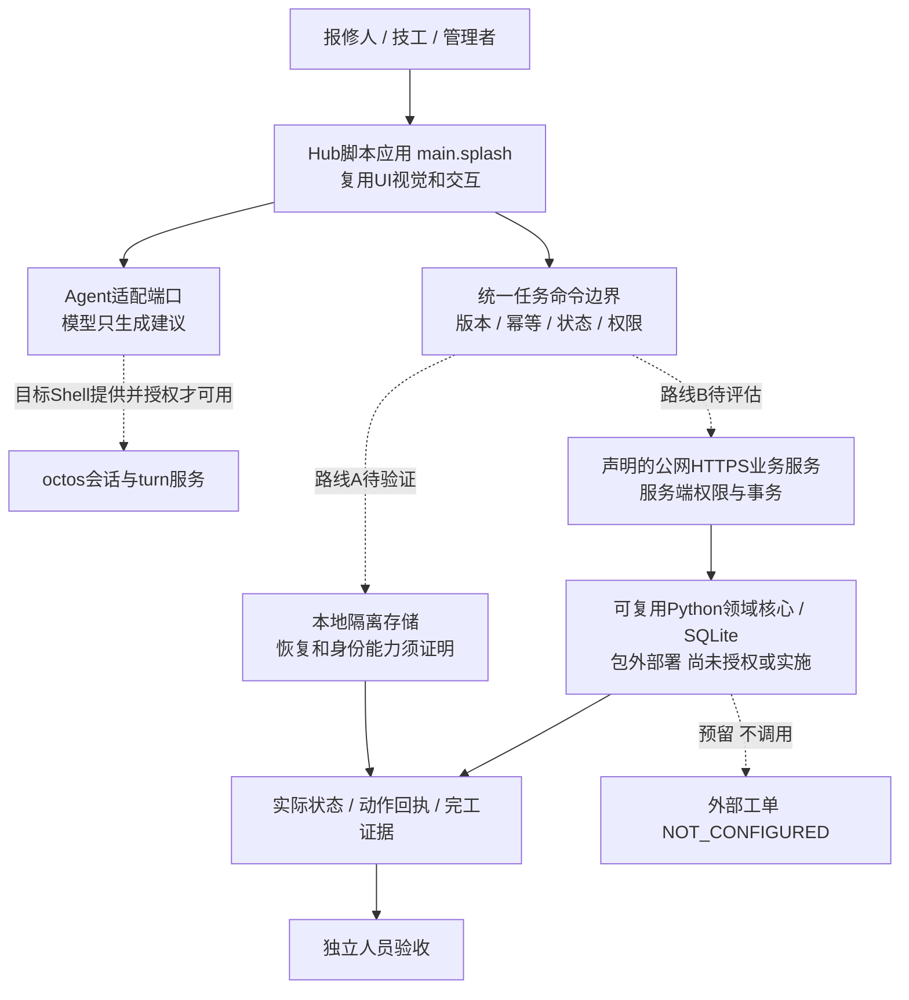

# 官方 App Hub 核对：交付形式、架构差异与准入标准

**2026-09-29增量优先读[14课程 #2与当前源码](14_COURSE2_LATEST_GUIDE_REVIEW.md)。** 本文保留9月27日证据；当前参考克隆已刷新。脚本包/网络/身份/存储边界继续有效；AI服务从仅待核查推进为上游条件实现，本项目未实测。scan问题数及agent文件边界在本页已补正，发布路线须区分桌面Hub和Rinx小程序。

日期：2026-09-27。状态：**官方仓库已克隆，文档与关键准入源码已核对；应用、模型、宿主和提交尚未验证。** 本文件优先决定Hub交付约束，12决定项目排期，11保留课程理解；00–10的领域规则继续保留，但旧Rust broker、本机Python配对、SQLite直接随包运行等宿主假设不得直接实施。

## 1. 结论

维修协作方向、报单/接单/设备身份/预约/进度/证据/独立验收，以及既有配色、按钮、页面信息结构可以沿用。**交付容器必须调整，不能只换名称后把旧项目交上去。**

Hub安装的是隔离应用包，支持 `page.card` 卡片和 `main.splash` 脚本两种入口。我们有状态、表单、动作和持久化需求，应优先验证**脚本应用**；纯展示卡片无法独立承担完整维修业务。Makepad负责原生渲染，不要求将所有业务代码改写成Rust。反过来，新增Rust二进制、Python服务、HTML/JS/CSS网站也不能直接装进这个bundle。

本次确定的是交付约束与接入方向，**没有批准把原本地任务事实库迁到公网，也没有把多人授权降为角色切换演示。** 真实身份、事务/协作、附件和Agent服务的可行路径须先通过G0；这属于架构阻断项，不是后期美化。

置信度：Hub规则与本地旧设计差异高；脚本UI适配路线中；完整业务闭环在目标宿主的可行性未知，须实测。

## 2. 证据版本与读取范围

Hub：`46d67e51b62827a1224b1aacddc2a7b9e69185fc`。开发指南：`7ddf8a16ab30bf8e095d55e5ceebe0478c1a8386`。克隆位置和来源见[参考快照](../../references/README.md)。

|编号|固定版本原文|本次依据|
|---|---|---|
|H1|[Hub发布规范](https://github.com/OctoSense-org/OctoSense-App-Hub/blob/46d67e51b62827a1224b1aacddc2a7b9e69185fc/docs/PUBLISHING.md)|包格式、权限、签名、当前Issue提交入口|
|H2|[开发指南](https://github.com/OctoSense-org/OctoSense-App-Hub/blob/46d67e51b62827a1224b1aacddc2a7b9e69185fc/docs/DEVELOPMENT.zh-CN.md)|卡片/脚本/系统应用/内置原生的区别，card-host限制|
|H3|[首个应用](https://github.com/OctoSense-org/OctoSense-App-Hub/blob/46d67e51b62827a1224b1aacddc2a7b9e69185fc/docs/FIRST-APP.md)|真实原生交互、截图、打戳、打包顺序|
|H4|[准入源码](https://github.com/OctoSense-org/OctoSense-App-Hub/blob/46d67e51b62827a1224b1aacddc2a7b9e69185fc/crates/app-hub/src/gate.rs)|文件白名单、8 MiB、摘要、签名、商店信息检查|
|H5|[扫描CLI](https://github.com/OctoSense-org/OctoSense-App-Hub/blob/46d67e51b62827a1224b1aacddc2a7b9e69185fc/crates/app-hub/src/bin/hub.rs)|scan未指定reviewer只生成问题；human-review也可能返回退出码0|
|H6|[服务名契约](https://github.com/OctoSense-org/OctoSense-App-Hub/blob/46d67e51b62827a1224b1aacddc2a7b9e69185fc/crates/app-policy/src/services.rs)|4个octos与45个Matrix精确能力名；声明不等于宿主已注册|
|F1|[脚本API](https://github.com/OctoSense-org/OctoScript-App-Design-Flow/blob/7ddf8a16ab30bf8e095d55e5ceebe0478c1a8386/docs/SCRIPT-API.md)|本地存储、HTTPS、运行时配额、事件与控件|
|F2|[宿主服务指南](https://github.com/OctoSense-org/OctoScript-App-Design-Flow/blob/7ddf8a16ab30bf8e095d55e5ceebe0478c1a8386/docs/HOST-SERVICES.md)|凭据由宿主持有；服务注册及新增服务涉及Shell变更|
|F3|[快速上手](https://github.com/OctoSense-org/OctoScript-App-Design-Flow/blob/7ddf8a16ab30bf8e095d55e5ceebe0478c1a8386/docs/QUICKSTART.md)|同级依赖、脚本模板、原生操作与重启验证|

H4–H6已读实际代码；F1的底层运行时限制本次依据官方指南，未重新克隆底层Makepad源码或实测。上游文档自称的“verified”不记作我们的验证。特别是F2当前仅列mail/llm服务，而H6已定义octos/Matrix服务名；两份文档的覆盖范围不同，不能据新增名称推定目标Shell已经实现了服务。没有在该Hub的README/发布文档发现本次比赛的截止时间、评分权重或指定模型；不能据此替换用户10月9日排期。

## 3. 我们要修改什么

|原设计/假设|现在的证据|本项目修改方式|
|---|---|---|
|扩展宿主Rust模块并配套本机Python，即可作为商店应用|H1/H2：内置原生随Shell发布；Hub包不含原生代码/Python服务|Hub版入口采用main.splash候选；不再默认修改宿主。Python保留为迁移资产、回归依据或经验证的包外服务|
|UI参考HTML可直接成为交付界面|H4白名单不含html/js/css|沿用视觉token与交互规范，映射到Splash/Makepad控件；HTML留在设计资料中|
|脚本请求127.0.0.1:8711可复用后端|H1拒绝http字面地址；F1拒绝私网/内网和非HTTPS|撤回默认loopback桥接；不能改用未受约束的socket能力绕开规则|
|SQLite表与事务可直接迁入脚本沙箱|F1只列文件存储API，未提供SQLite、rename或通用二进制写|保留业务协议与SQL为服务端/测试参考；本地脚本存储需另证崩溃一致性与冲突，不声称JSON等价事务|
|照搬Web账号密码与配对码输入界面|H1/F2不允许应用收集密码/PIN/验证码，账号由宿主sheet办理|身份映射重新设计；不可把普通输入框伪装成密码框，也不能用前端role作为真实授权|
|声明llm即可调用比赛模型|H1：llm为系统应用管理provider；有octos.*助手能力名|先核对目标Shell的octos服务、授予、真实调用和响应；不能编造参数或把签名清单当模型调用成功|
|card-host测通即证明助手/Matrix可用|H2：card-host不注册宿主服务|它用于隔离UI/存储检查；助手和账号能力到实际Shell另验，缺失显示不可用|
|本地文件可无限承载证据与历史|H4包8 MiB；H1默认安装存储上限16 MiB；F1单文件1 MiB|设计截图压缩、证据配额和存储满错误；运行证据不塞发布包，照片写入途径单独验证|
|提交源码PR或等待自动发布CI|H1当前是应用自己的公开仓库/tag/SHA＋Hub Issue，维护者发布|取消假设中的发布Action，不改Hub目录/索引/制品；区分提交记录与商店收录|

**UI不是全部重做。** 颜色、层级、按钮形态、任务详情、预约确认、进度时间线和验收交互继续复用。需改的是控件实现、宿主授权/能力不足提示、网络与存储失败反馈。已有四版HTML不作为原生截图；只落地一版。`listing.json`关联同一个应用自有图标；平台只填实际测过的系统，不照抄模板中的android。

## 4. 调整后的架构边界与路线裁决



实线表达职责，虚线是候选依赖；没有一条虚线表示已经接通。路线A/B互斥决定任务权威，不能双主写入。

**A：保留本地优先意图。** 在脚本内实现必要规则和持久化，利用真实宿主能力做身份/协作。符合用户数据在本地的原方向，但目前无SQLite事务、跨实例锁、照片写入和可靠后台唤醒的实测证据。仅单进程切换角色的演示不能通过多人权限与并发验收。单文件fs.write成功也不证明掉电安全。本路线只有在G0证明关键能力后才进入大规模开发。

**B：脚本界面＋包外HTTPS业务服务。** 就保留现有领域核心、并发控制和未来接现有系统而言，更容易沿用后端设计；但新增公网部署、身份信任和数据离机范围，且官方网络允许不等于本赛事已接受该部署形式。必须证明无应用内密码/秘密、可验证身份、真实HTTPS访问、断网状态，再明确调整本地事实库要求。不是本轮擅自启用的替代方案。

新增自有 `repair.*` 宿主服务不能靠往manifest写名字获得；能力表是封闭列表，扩展涉及Hub/Shell代码与维护者协作。把所有Python改成Rust也不会自动变成可安装Hub包。两条路线都卡住时应报告具体平台缺口，请赛方澄清，而不是换个名称绕过限制。

长期产品保持领域边界：UI → 命令执行 → 权威状态 → 可核对回执 → 外部连接器。具体存储、身份、模型、通知作为适配端口；未来替换适配器时继续遵守原业务状态和验收规则。

## 5. 准入机制：把门槛提前，不改低业务标准

|门槛|编码方必须拿出的证据|不能冒充的结果|
|---|---|---|
|G0.1 工具与入口|固定Hub/Design-Flow/运行时SHA和工具链；hub、card-host构建；脚本原生窗口真实输入|仓库克隆成功不等于环境跑通|
|G0.2 存储与命令|一项任务确认写入、回读、重开；重复与旧版本拒绝；失败写/配额满不丢前态|模板记事本存一条记录不等于业务事务完成|
|G0.3 身份与协作|实际宿主身份可信来源、项目映射、独立会话越权拒绝、并发接单只一人成功|角色标签切换不能当三账号授权|
|G0.4 Agent|声明需要的精确octos能力；目标Shell实际提供；真实模型输出→草稿→人工确认；拒绝与服务缺失可见|card-host或manifest声明不能当助手已通；prompt不等于LLM|
|G0.5 证据与跟进|真实证据采集/存储/回读路径；到期记录恢复、去重；区分前台计时与关闭后的唤醒|预置图片不能证明现场上传；定时器不能证明后台常驻|
|G0.6 路线冻结|对A/B及平台限制作有证据的选择；同步03/04、实现目录、图册和测试适配|不强迫后续模型从互相冲突的旧文档自行猜方案|
|G1–G4|原维修闭环、38项业务与12项UI要求，按已选路线实现并记录结果|迁移234测试、SQL约束校验不等于新业务验收|
|G5 包与发布|最终字节、准入报告、审阅结果、截图、版本来源和提交回执各自留证|check通过≠视觉通过；scan退出0≠审阅通过；Issue存在≠收录|

T32旧本地配对机制及T17 SSE属于路线相关用例：选定路线后**显式版本化替换技术步骤，保留身份绑定/过期/撤权/断线回读目的**，不能默默删除或在未执行时标通过。其余并发、独立验收、来源与失败恢复要求不降低。

## 6. 应用仓库和正式交付目录

以下是后续编码的拟定结构，不是已创建的应用：

```text
应用自己的公开仓库/
  README.md                 固定版本、启动、数据来源、限制
  AGENTS.md                 本项目要求＋官方入口，合并不覆盖
  LICENSE / NOTICE / PRIVACY.md
  bundle/                   唯一Hub安装内容
    manifest.json           schema 1、稳定id、版本、能力、摘要
    listing.json            描述、平台、发布者、隐私地址、图标与截图
    main.splash             原生脚本入口和交互
    assets/                 应用自有图标与本地素材
    screenshots/            从真实运行捕获的PNG
  evidence/                 版本、构建、交互、测试、模型与审阅报告
  tests/                    原生业务及失败路径测试
  docs/                     需求、设计及生成过程
```

这个公开交付仓库不能由当前工程整目录上传替代。旧后端、开发参考和源数据先做权属与公开范围检查；实际需要的可公开源码才进入作品仓库。私钥、token、运行库、日志、review packet、编码协作指令AGENTS.md、两个参考克隆和HTML参考稿不进入bundle。9/29补充：按官方声明的应用运行AGENT.md/tools.json等可被新版Hub接受，但Shell运行支持须按14另验；未采用的Agent文件不为凑概念加入。开发期间运行状态统一指定到本工程runtime下；真正安装后的数据位于宿主应用隔离目录，不能硬编码开发机绝对路径。

包内仅使用H4白名单文件；总大小≤8,388,608字节，不含软链接。每次变更含截图都会影响摘要。图标采用本应用自己的标识，无须改成OctoSense标志。建议用小体积SVG/PNG并做小尺寸和原生渲染检查，不能以文件存在代替可见性。

## 7. 交付机制与成功定义

1. 编码与原生操作：用未签名开发副本运行，存任务、重开、测试正常/失败/空状态，取得并查看真实截图。card-host不验证发布者公钥，因此已签名包即便加allow-unsigned也不适合作该开发验证。
2. 固定包内素材和商店信息：manifest、listing、图标、至少1张真实截图。赛事材料仍保留2张关键截图和2–3分钟完整演示，不能把商店最小1张当赛事要求自动降低。
3. `hub stamp` → `hub check --allow-unsigned` → `hub scan --packet`（报告写包外）。scan不指定reviewer只生成问题，必须回答；9/29版本为7个基础问题，有agent文件则追加1个，以实际packet为准；使用reviewer时保存其结构化route/reasons。`human-review`不算pass，即使命令退出码为0。
4. 推荐发布前签名并用对应公钥复查。官方允许首次unsigned提交；一旦登记签名身份，更新必须维持该身份。私钥只留发布者安全位置。最终冻结源码tag和完整SHA；签名后改任一文件都需重新stamp、签名和检查。
5. 在应用自己的公开仓库发布固定版本，随后到Hub开 `Submit <app id> <version>` Issue；提交仓库URL、tag、完整SHA、bundle路径、发布者ID/公钥或首次unsigned声明、该版本完整check输出和scan回答。**不提交修改catalog.json/index/artifacts的PR；当前没有发布Action。**
6. 保存两个状态：**已递交**＝Issue地址及其绑定版本；**已收录**＝维护者检查通过并回复的catalog sequence/结果。首次提交可能等待人工，10月9日前递交不保证同日前维护者完成收录。比赛是否以递交或收录计时仍需主办方明确，不能自行设定。

以上是交付标准，不是本轮公开发布授权。本轮没有创建应用仓库、生成密钥、调用reviewer、创建Issue或提交作品。

## 8. 排期差异与立即行动

保留10月6日晚主要功能完成、10月7日验收、10月8日优先提交、10月9日初赛截止。**仓库带来的变化是前置风险和递交流程，不是新的截止日期。**

- 9月27日：官方仓库/版本/提交规则核对已完成；工具链构建、原生启动、账号/AI验证未完成。
- 9月28日：先做G0六项并决定运行路线；UI保留一版，仅验证关键组件。身份或权威存储仍无路径时，当天报告对原排期的影响，不把接入风险挪到10月6日。
- 9月29日–10月6日：逐业务切片推进，尽早形成可检查bundle；商店描述、素材和来源记录随开发准备。
- 10月7日：干净环境独立复跑，同时执行本地准入与审阅；准备公开包。
- 10月8日：获发布授权后优先递交Issue，留维护者审查反馈的缓冲；本地测试/准入失败先修正。
- 10月9日：按用户确定日期核对递交证据；另记录收录状态。维护者排队时长不可控，应尽早确认比赛认定口径。

最少需向赛方确认三件事：指定Shell完整版本及其octos/身份服务；业务服务能否包外部署及账号接入方式；10月9日的精确时区/时刻与“提交成功”的认定口径。当前只列问题，未向任何人发消息。

## 9. 本次改动与验证边界

新增本评审及官方参考版本索引，更新入口、技术栈修订、G0/G5和排期的提交路径。旧业务代码、契约和SQL保持原样；它们是领域参考，不是Hub已完成实现。旧SVG/HTML仍为历史宿主方案，本文件的新边界图优先，G0裁决后再统一重绘。

本轮只执行克隆、版本/工作树检查、文档与源码阅读、项目离线设计/迁移检查。没有运行上游构建、hub check/scan、原生GUI、真实模型或业务验收；不声称G0通过。具体检查输出记在[验证记录](../VERIFICATION.md)。
