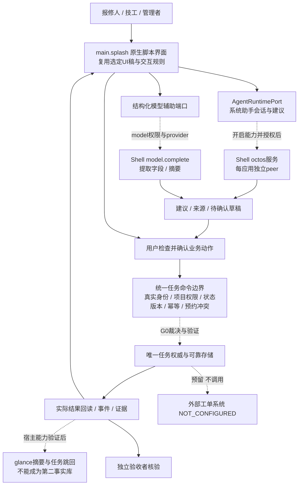

# 课程 #2 与最新制作发布指南：基线差异及执行要求

核对日期：2026-09-29。结论性质：**课程转写、官方文档和固定版本源码核对；不是应用接入验收。** 本文优先修订13中的AI能力与发布细节；13的脚本包、身份、存储边界继续有效；12继续决定项目期限。

## 1. 对本项目的结论

维修协作方向及报单、接单、设备身份、桌面展示、预约、进度、完工、独立验收全部保留。四版UI参考继续使用，只选一版落地。无需为了课程展示的设计流水线重新画四套界面。

**变化最大的是AI接入已从“只有能力名、宿主支持待查”推进到“上游存在可验证实现”。** 当前Shell已合入一次性模型调用、隔离应用独立助手peer、首次使用同意及普通应用发布glance卡片。但隔离应用助手默认关闭，需要内核、配置及用户授权；要求审批的助手工具调用仍会被拒绝。不能把这些合并记录写成我们的应用已经可用，也不能据此设计自动执行任意维修工具的Agent。

最新Design-Flow README中的AI状态仍沿用9月27日记录，落后于Shell代码与Shell自己的AI服务文档。后续编码须以本文固定版本矩阵及实测结果为依据，不能只读一个main分支README。**身份、多人协作、事务存储与证据写入仍是G0阻断项。** AI接口新增没有替我们解决这些业务基础能力。

置信度：课程可见转写覆盖、提交结构及已读源码中的注册/限制为高；课程转写中的模糊专名和日期为低；本机目标宿主运行、业务闭环和按期完成为未知，须实际验证。

## 2. 阅读范围与来源版本

课程来源：[Agentic App 黑客松课程 #2](https://meeting.tencent.com/crm/2pwMmVgx24)，页面显示2026/09/28 19:44。已读取AI纪要并逐段读取自动转写，段号0–98共99段，缺段数0；第一段00:00，最后一段01:29:44；播放器时长约01:31:22。**这是完整可见转写阅读，不是逐秒音频听校或逐帧视频审阅。** 未下载录像，工程未收录完整转写。自动转写中的AutoScience、AutoScript及manifest误写，仅在官方仓库能佐证时统一名称。

|资料|本轮固定版本/范围|如何使用|
|---|---|---|
|[Design-Flow中文入口](https://github.com/OctoSense-org/OctoScript-App-Design-Flow/blob/9586a12044873267dddc39c3b56d7e94f3c6abfe/README.zh-CN.md)|`9586a12044873267dddc39c3b56d7e94f3c6abfe`|制作流程、脚本、原生验证、发布入口；其中AI状态需按下文纠正|
|[Hub发布规范](https://github.com/OctoSense-org/OctoSense-App-Hub/blob/6741dea8d6b5e1a6062dfc23ae6b0d4240bcc747/docs/PUBLISHING.md)|`6741dea8d6b5e1a6062dfc23ae6b0d4240bcc747`|bundle、agent文件、scan和Issue提交|
|[Shell AI服务说明](https://github.com/OctoSense-org/OctoSense/blob/a5d847a2a5091c1274d68dd0de1f43c8b0215bf1/docs/ai-services.zh-CN.md)|`a5d847a2a5091c1274d68dd0de1f43c8b0215bf1`|当前AI服务边界，结合注册与执行源码核对|
|Shell关键源码|同上：`crates/ai-host`、`apps/ai-providers/host-service`、`crates/shell`|存在性/配置/拒绝路径；本轮未构建|
|Design-Flow运行时锁|Octoscript-Makepad `b33f494b963759088edf5785fc626cb8593818ee`|已读锁文件，未安装运行时|
|相关运行时版本|Makepad `4fdcfccc127b700f1fc01aa1a5488af938dd7f3d`；Octoscript `68f6a9df55692b5d8ef8873a12721e279a3f40d6`|依赖来源记录，不代表本机已经检出或测通|
|Shell实际锁定Hub|`e8601b80ce104db2e48208094714bdcffdce6b5a`|与单独参考克隆6741不同；G0必须记录二者，不能强行替换为全部最新|

参考克隆已更新至上表版本，保留旧提交及本地main分支，当前为detached HEAD，两份工作树干净。没有完整克隆Shell，只读取其公开固定版本文件及PR状态。完整出处和文件哈希见[本轮源码索引](../../references/course2-source-evidence.json)，参考目录说明见[快照索引](../../references/README.md)。

## 3. 课程要求及其对我们的影响

以下时间均为课程播放器相对时间；转写为证据线索，表述为归纳而非逐字引语。

|时间|课程内容|本项目响应|
|---|---|---|
|01:52、02:25|README为制作发布入口；编码Agent不限，OctoLoop可选|保留用户指定的Codex Router工作方式；赞助模型用于后续实现，开发模型与应用运行模型分开|
|04:16–06:46|做实际可运行应用；应用/小程序基于OctoScript，描述目的、UI及输入输出数据|保留真实维修闭环；Hub主线采用main.splash，不交旧网页或新增Rust原生程序冒充脚本包|
|07:37–11:54|演示从文字到8–12张图、结构化设计资料再到应用的可复用流水线|复用既有UI规范和四版参考，补选定稿、控件映射、实现截图、修改记录；图数是示范，不擅自升格为硬性提交数量|
|12:23–15:35、19:47|应用应连接系统绑定助手，声明权限、拥有自己的peer；隔离应用连接功能刚加入|G0验证实际octos服务，不能用自有模型网页代替系统助手接入；不能以课程演示断言本机可用|
|21:27–23:28|原生远程UI/自测；先把基础应用做完整，再补AI|确定性业务按钮在模型失败时仍能工作；原生操作与结果回读分别留证|
|25:59|看功能完整性、Agentic正确性、自己的需求及技术栈；允许沿用原项目，尊重原有授权|复用业务思路与规则；旧Python代码留作资产，不直接随bundle安装；未公布数字评分权重，不自创评分表|
|33:41|自己的Rust原生应用也需转换为脚本应用|撤回“全部用Rust重写即可合规”的假设；Rust主要是平台技术底座|
|35:59|转写出现含糊的“14号之前”|不据此改期限；用户确定的10月9日继续有效，精确关门时刻仍待正式公告|
|36:40、55:14|Rinx是协作小程序方向；桌面应用与小程序共享数据为讨论方向|不为比赛新增第二个客户端；跨端共享须真实设计与验证，不能当现成功能|
|01:00:20、01:15:37|桌面应用走商店；自己的公开仓库/tag，经Hub Issue与维护者发布|沿用13的桌面Hub路线，提前准备固定源码和准入证据|
|01:17:01–01:17:59|Rinx小程序暂不依赖App Hub，给应用仓库让评委导入，详细流程后补|区别两条提交路线；不能把桌面Hub流程说成所有赛道唯一入口|
|01:23:19–01:29:44|介绍MiniMax初始额度、凭进度申请补充及晋级后的Kimi支持计划|只是会议政策说明，不代表我们已领取或获批；可留存进度和仓库证据，不自动领用、发消息或调用模型|

纪要与逐字稿有冲突时优先查上下文：例如独立peer注册不是“向MiniMax注册业务身份”。官方制作指南也明确技术发布说明不决定比赛赛程；课程、商店规则和赛事报名回执分别记录。

## 4. README过时之处与当前能力裁决

|能力|本轮实证|当前判定与设计限制|
|---|---|---|
|`model.complete`|[#95已合并](https://github.com/OctoSense-org/OctoSense/pull/95)，ai-host注册model服务|代码可用，须model权限和provider配置；一次结构化请求，无工具、历史或Agent记忆。适合报修字段提取与摘要，不等于系统Agent|
|`octos.session.open/history`、`octos.turn.start/interrupt`|[#106已合并](https://github.com/OctoSense-org/OctoSense/pull/106)，contained服务注册；[#120首次同意已合并](https://github.com/OctoSense-org/OctoSense/pull/120)|须宿主内核、开启contained_apps及用户同意；每应用`card.<app_id>` peer。不是任意应用默认即能调用|
|助手工具审批|contained执行路径直接拒绝approval请求并记录denied_approvals|不能设计成“助手自动批准接单/完工/验收”；AI建议交给应用自己的命令边界，业务确认与实际执行结果独立记录|
|普通脚本应用`glance`|[#86已合并](https://github.com/OctoSense-org/OctoSense/pull/86)，Shell服务绑定调用应用ID|可验证publish/withdraw/list；作为任务摘要与跳回入口候选。不是任意系统悬浮窗；跨重启更新、数据源与打开路由仍需测|
|`sys.digest`数据源|[#87本次查询仍为未合并draft](https://github.com/OctoSense-org/OctoSense/pull/87)|不能假设自己的维修数据已经能作为任意实时glance数据源|
|`agent`/`tools.json`/`AGENT.md`/skills/triggers|最新Hub能描述和检查；Shell当前AI文档仍列事件驱动应用Agent为规划中|包能准入不等于工具已注册或后台触发会执行；不把该链路放入P0自动写入依赖|
|card-studio|Hub新增L0卡片原生渲染/布局测量与视觉审阅工具|可辅助glance卡片；不替代main.splash业务窗体的真实操作和截图验收|

直接源码：[ai-host注册与策略](https://github.com/OctoSense-org/OctoSense/blob/a5d847a2a5091c1274d68dd0de1f43c8b0215bf1/crates/ai-host/src/lib.rs)、[隔离应用助手与审批拒绝](https://github.com/OctoSense-org/OctoSense/blob/a5d847a2a5091c1274d68dd0de1f43c8b0215bf1/crates/ai-host/src/contained.rs)、[一次性模型调用](https://github.com/OctoSense-org/OctoSense/blob/a5d847a2a5091c1274d68dd0de1f43c8b0215bf1/apps/ai-providers/host-service/src/complete/mod.rs)、[glance服务](https://github.com/OctoSense-org/OctoSense/blob/a5d847a2a5091c1274d68dd0de1f43c8b0215bf1/crates/shell/src/glance.rs)。以上是代码阅读结论，未在本机执行。

桌面助手的关键前提为配置`OCTOS_APP_CORE_BIN`、运行具备相关功能的Shell、配置provider、通过精确权限授予、启用`OCTOSENSE_CONTAINED_APPS=1`并完成首次同意。环境开关是待验证运行条件，不能当作获准修改评委环境的证明；发布前须获得指定环境的支持结论。不能收集用户模型密钥到应用表单。`model`与`llm`不同，后者是系统provider管理能力，普通应用不自行申请来绕过宿主。

另外，contained服务使用的account标识为`device`，它与应用peer隔离都**不等于报修人、技工、管理员的业务身份认证**。多人接单和独立验收仍需可信主体与项目权限，不得用一台机器的角色切换代替。

## 5. 本项目接入架构增量

下图是新的接入设计。节点不代表已实现；身份和存储仍由G0在13的本地/包外路线之间裁决，不能双主写入。

实现原则：AI仅输入获授权的设备资料、历史和任务投影，输出建议及来源；缺失字段先补齐，不生成设备事实。用户确认后，命令边界重新核验可信主体与当前版本，再写入和回读。模型文字、助手会话与UI乐观状态均不能作为“报单成功”证据。旧runner后续迁移也走同一边界，不保留绕过路径。

优先验证系统助手承接解释和持续对话；有明确结构需求再增加model.complete辅助，避免同一意图默认串行调用两个模型。模型失败时保留人工报单、接单、预约等确定性入口。开发用Codex Router、应用系统助手和未来事件驱动应用Agent是三个不同层次，不能混为一谈。

原六张SVG/HTML含旧宿主部署记录，仍保留历史标记；**本图与13的边界优先**。G0冻结任务权威后再统一重绘部署图，不现在虚构已选存储和身份方案。

## 6. 编码方新增的准入与验收证据

|检查|需要提交的实际证据|未通过时的处理|
|---|---|---|
|G0-A 版本与环境|Hub、Design-Flow、Shell及各自锁定依赖SHA；工具链；构建日志；开发宿主与最终评委环境区别|按仓库锁文件准备，不将Shell依赖手动升到参考克隆版本；仓库聚合到OctoSense的desktop/phone/apps/rom后，沿对应setup流程|
|G0-B 脚本与助手|main.splash真实打开；实际Shell中完成授权和一轮octos调用；记录peer与真实响应、provider/model和错误|独立card-host仅验证其提供的能力；不拿UI渲染当AI调用通过|
|G0-C 否定路径|默认关闭、内核缺失、用户拒绝、provider失败、工具审批被拒绝均有清晰状态；被拒绝后业务状态不变|不自动重试写入或显示虚假成功；参数和返回值从选定版本源码/样例核对|
|G0-D 结构化辅助（若采用）|model权限、一次真实请求与schema约束；异常输出校验；无密钥落入应用包|不把一次性调用标成带记忆的Agent；用户可手工补字段继续|
|G0-E 业务底座|沿13验证真实身份、项目授权、并发抢单、持久化/恢复、附件途径；跨会话独立验收|device/peer/角色切换不算认证；模型连通不能让其他G0项自动通过|
|G3/G4 原生与AI闭环|同一任务真实操作、回读、重开；建议到人工确认再到命令回执；失败/空状态；一个有来源的主动跟进|38业务用例和12UI用例仍适用；前台计时不冒充关闭后后台触发|
|G4-glance（采用时）|真实Shell发布、更新/撤回、打开同任务；过期/重开/来源边界|未实现的sys.digest和自动后台Agent不能被当作依赖已通；先证最小摘要入口|
|G5 准入与提交|最终包check输出；按实际scan packet回答；真实截图；固定源码；Hub回执与赛事回执分列|准入通过不等于商店收录或比赛提交完成；不因赶期限降低标准|

在本次已读Hub版本，scan有7个基础问题；声明且载入agent文件时追加1个问题，故应回答**实际生成的7或8个问题**，不要硬编码永远7个。来源：[scan源码](https://github.com/OctoSense-org/OctoSense-App-Hub/blob/6741dea8d6b5e1a6062dfc23ae6b0d4240bcc747/crates/app-hub/src/scan.rs)。`AGENT.md`是按官方声明可进入包的应用运行提示；本工程`AGENTS.md`是编码协作要求，不进入bundle。P0未采用的agent运行文件不要为了凑概念无效打包。

G0命令、真实模型与数据写入测试由后续编码任务在授权范围内执行。本次只交付设计与验证清单，不消耗赞助Token、不配置密钥、不部署或提交作品。

## 7. 排期与交付保持什么、改什么

10月6日晚主要功能完成、10月7日验收、10月8日优先提交、10月9日初赛截止继续使用。课程转写未提供足够明确证据推翻这一排期；不编造截止的时分。

**截至本轮，原计划9月28日完成的G0仍无通过记录，已越过计划节点。** 9月29日优先完成版本固定和最小实测，由编码方报告G0-B/E的通过证据或具体阻碍；这是一项补救优先级，不是宣称今天一定能解决。任务权威与身份尚未裁决时，可以继续梳理纯领域规则和固定夹具，但不要全面铺开依赖假设的UI/后端实现。内部里程碑保持为目标；能否赶上必须由实际切片结果重新评估。

交付记录拆为四项：①本地准入与独立复跑；②公开固定源码和Hub Issue已递交；③维护者商店收录；④本赛事规定入口的提交及回执。桌面版仍走Hub，另确认赛事如何关联Hub记录及是否要求截止前收录。Rinx例外只记在规则中，不改变我们的主线、不增做第二客户端。

## 8. 本轮修改与后续维护

新增本文及固定源码索引；更新入口、03技术栈、05门槛和接手提示、06官方映射、09 Agent边界、10 UI复用说明、12风险状态、13扫描细节与参考版本索引。文档检查脚本增加本文必需项。旧业务源码、OpenAPI、SQL、四版UI参考与运行数据保持原样。

后续先以G0实测裁决适配与任务权威，再同步03/04和全部图源；若实际契约发生变化，独立版本化并记录兼容迁移，不能静默改旧ops/contracts。每次上游更新记录固定SHA和文档/代码差异，不随main文本自动覆盖已验证版本。

实际检查结果见[验证记录](../VERIFICATION.md)。设计包检查和79文件迁移校验只能证明文档结构与基线完整，不能证明模型、宿主、业务、发布任一门槛通过。
