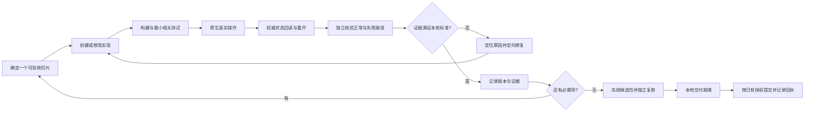

# 石墨版：从创建到交付的构建—验证—修复循环

日期：2026-09-30。用户决策：比赛Token已到；UI选择石墨；可以简单，但必须完整闭环。本文是**交给编码模型执行的循环指令和完成标准**，不是应用已构建、模型已配置或验收已通过的记录。

执行入口：[启动提示词](../build-loop/START_PROMPT.md) · [验收台账](../build-loop/ACCEPTANCE.json) · [每轮记录模板](../build-loop/ITERATION_TEMPLATE.md)。业务规则沿用01/04，平台边界按14/13的固定版本，期限按12。以后平台变更先核对版本和能力，不假设9月29日源码状态永远不变。

## 1. 必须交付的最小成品

一个OctoSense桌面脚本应用，一套石墨UI，一个维修主场景，一套真实任务事实源。报修人、技工、经理通过可信且相互独立的身份参与同一事项；数据可以是明确标注的种子，操作必须真实生效。

完整主线：**输入报修 → AI辅助形成可编辑草稿 → 人确认报单 → 技工接单 → 确认设备 → 提议/确认预约 → 开工 → 记录处理与证据 → 提交完工 → 另一主体验收 → 关闭重开读回最终结果**。

再跑一条回路：验收退回 → 保留旧证据 → 技工补充处理 → 再次完工 → 独立验收通过。修复旧设备的再次故障可新建关联任务，不能篡改已完成历史。



“简单”允许压缩页面数量、设备样本、动画、筛选和展示范围。**不删除**01中的R01–R10、14类任务命令、独立验收、预约冲突、证据、失败恢复及模型贡献；不把默认关闭的外部工单伪装成已接入。语音、摄像头/NFC、实时IoT、复杂排班、多皮肤、多客户端、支付采购、通用Agent平台不进入本轮。

建议验证样本：一个主演示项目、两个用于服务关系核验的空间、两个设备候选；报修人、两名技工（用于并发）及经理，另有越权测试主体/项目。数量是测试夹具选择，不是生产规模或官方限制。所有身份和动作均按实际可信边界验证。

## 2. 图形和交互冻结为石墨

原稿：[04 石墨](../../design-references/2026-09-26-ui-variants/04-graphite.html)。从现有CSS提取下列参数，转译到脚本原生控件；不在bundle中嵌入HTML/CSS/JS。

|用途|正式设计初值|
|---|---|
|背景/表面/次级表面|`#111A1B` / `#1A2628` / `#223638`|
|正文/辅助文字|`#E2EDEA` / `#A4B8B3`|
|主按钮/按钮文字|`#91D5BE` / `#132F27`|
|边界/危险文字|`#35494A` / `#FFABA0`|
|容器/按钮圆角|12px / 7px（按宿主缩放适配）|

最少三个主页面：工作台、任务详情、设备身份；报单、预约、证据与验收使用面板。通知/收藏并入工作台，经理分配放入详情。采用紧凑导航、任务队列和详情主栏，收窄时保留关键动作，不新增独立桌面壳。

每个状态只突出当前主体的一个主要动作。提交期间禁用重复按钮，失败保留输入；成功依据业务回执与回读显示。灰色禁用必须解释原因，错误不能只靠红色。日期显示完整日期、起止与Asia/Shanghai，避免只写“明天”。设备标识、安装位置和服务空间分列。AI建议标来源、缺项和待确认，不与已执行事实混排。

模型失败提供手工编辑入口；身份/权限失败不能靠手工入口绕过。未接入外部工单明确显示。最低测1280×800、窄窗、文字放大、长中文、键盘焦点、滚动与错误状态；截图来自真实原生界面，实际测量对比度，不把CSS数值自动视为视觉验收通过。

## 3. 第一次启动：先创建工作基础，不空转

1. 读根README、AGENTS、架构/迁移/验证记录，再读本文件、14、13、12、01/04/05/09/10。禁止访问旧WAgent作为实现捷径。
2. 检查当前已有实现，保留他人改动；已有资产复用，不重复搭架。新任务按创建时间命名；记录当前实际模型、供应商及Router路由状态，不能用技能已启用代替路由已确认。
3. 区分开发模型Token与产品运行模型配置。只使用已授权的本地配置/宿主provider；不让用户把密钥贴进提示词，不扫描或打印秘密，不自动切换计费渠道。额度不足、401/429时记录原因，不循环消耗Token。
4. 执行已有离线设计和迁移检查作为起点；旧234测试结果只算历史，涉及旧代码修改时再执行相关回归。
5. 创建下列结构。文件有真实内容才登记完成；目录不是功能，README不是测试。root未有Git时，在后续真正编码且需要版本管理时初始化本工程或独立作品子仓库，禁止自动提交整个历史资料目录。

```text
app/                         编码阶段创建；本轮尚未创建
  README.md                  从干净环境启动、演示、重置测试数据
  bundle/
    manifest.json            按选定官方模板，不编造权限和方法
    listing.json
    main.splash
    assets/                  仅准入允许的图标与必要素材
  src/                       构建源文件（仅平台支持时组织为模块）
  tests/                     领域、适配和端到端用例
  fixtures/                  明确来源的示例；与运行数据分离
  scripts/                   固定版本的构建、启动和校验入口
  docs/                      版本锁、路线裁决、复现和交付说明
docs/build-loop/             本轮已提供的执行指令、模板与台账
runtime/build-loop/          后续每轮日志、回执、截图、报告
runtime/releases/           后续冻结候选包及摘要，测试不改已冻结包
```

实际文件扩展名、模块导入和构建方式以固定官方示例为准。`app/src`不是新增Rust二进制的许可，bundle不得包含Python/运行库/密钥/完整工程/开发指令。若G0确认复用包外业务核心，另外记录其目录和部署边界；当前不自动启用公网服务。

## 4. 第0轮：必须作出可验证的架构裁决

目标不是写更多架构文档，而是取得一个原生按钮触发合法动作、持久回读且身份可信的最小切片，以及一轮真实系统助手响应。

|问题|必须完成的创建与验证|不通过时|
|---|---|---|
|宿主与包|固定Design-Flow、Hub、Shell及锁定依赖，按各仓库流程准备环境；创建最小main.splash；构建并实际打开|记录真实命令、版本与首个错误，修最小阻断；不用网页截图冒充|
|可信主体|证明报修人与技工各自的会话来源、项目映射与撤权；客户端伪造actor无效|peer/device不是业务账号；不能先用切角色冒充上线授权|
|唯一事实源|验证写入、回读、重开、失败注入与并发；任务/预约/事件/回执一致|不能宣称一次fs.write等于事务；禁止双主数据库|
|证据|真实选择/保存/回读一份附件，验证归属、类型/大小限制和失败清理|固定图片只算夹具；不能以预置图片证明上传完成|
|模型|指定Shell运行真实octos一轮，测试缺内核、关闭开关、拒绝同意和provider失败；需要结构化辅助才加model.complete|人工功能可开发，真实AI项不能记通过；无需审批的建议与业务执行分开|
|提醒/意图视图|验证可恢复的到期检查、去重，以及官方可用的任务摘要/跳回路线|关闭后无唤醒就如实记录；未实现的后台Agent不作依赖|

**裁决顺序固定：**先验证13的本地优先路线A能否满足以上硬约束；若不能，给出最小复现和缺口。包外HTTPS路线B只有在符合用户授权、数据边界和赛事环境支持时才可选；先准备具体可审阅方案再请求必要决策。不能借“闭环”二字擅自部署公网，也不能以“先演示”降低真实身份/事务标准。两条路线均不成立时，状态为BLOCKED，报告平台能力缺口；不能承诺靠prompt补齐。

通过后创建`app/docs/route-decision.md`与`runtime-versions.json`：任务权威位置、主体来源、存储一致性、证据路径、AI能力、提醒恢复、选定版本、实际验证命令与证据路径。同步03/04、架构图与T17/T32平台适配步骤；语义不变，技术替换单独记修订，不静默删除测试。

## 5. 顺序构建的完整轮次

每轮都运行第6节小循环。第1–2轮可先写纯领域逻辑/夹具，涉及真实宿主和权限的通过判定必须等第0轮。不得用“所有页面先做完”替代纵向切片。

|轮次|创建/实现内容|本轮必须看到的结果|验证关联|
|---|---|---|---|
|L0 基础裁决|上节环境、身份、存储、附件、模型、提醒/视图探针；冻结路线|真实最小切片及固定版本，关键缺口有处理结论|G0-A～G0-F台账|
|L1 任务内核|8状态、14命令、字段验证、权限、版本/幂等、事件与回执、测试时钟、禁用外部适配器；迁移旧写入口或在比赛模式拒绝|合法动作有唯一回执；非法动作无副作用；默认无外部请求|T02/03/05/15/16/18/22/24/27/31/32|
|L2 首段原生流程|石墨工作台/报单面板，真实模型草稿、补歧义、人工确认、技工接单与经理分配|真实原话→DRAFT→OPEN→ACCEPTED；两技工同时接单只一人成功|T01–06、T25/26、U01–03/07/08|
|L3 设备与预约|设备页、编码/二维码载荷、来源与服务关系、绑定、提议/确认/拒绝/改约|正确设备与有效预约；并发冲突被拒；旧约保留直到新约确认|T07–14、U04/05|
|L4 处理与验收|开工、处置记录、证据上传、完工、独立验收/退回、取消与资源释放|同一任务走到COMPLETED；另跑退回后重做；技工不能自验|T09/19–22/31、U03/06|
|L5 助手与持续跟进|设备/历史来源检索、最新阶段建议、过期建议拒绝、预约临近未开工提醒、真实任务意图视图、收藏|三条真实模型链路均有输入/来源/输出；提醒重启恢复且去重；视图跳回同任务|T23/25/26/28–30、T33–38|
|L6 全面恢复与UI|响应丢失、断线、旧版本、越权、附件失败、配额满、重启；键盘/窄窗/对比度/长文本/加载/失败状态|任务状态可解释；输入保留；恢复无重复写；真实截图无关键裁切|T01–T38全部适用项、U01–U12|
|L7 打包与独立复跑|最终素材、manifest/listing、实际权限、来源/隐私/许可说明、构建启动入口；干净环境复跑、打戳/check/scan|同一冻结版本的源码、包摘要、测试报告、演示与截图一致|P01–P05台账|
|L8 递交与回执|准备公开源码tag/SHA和Hub Issue内容，按届时已有授权实际递交；保存赛事入口回执|区分本地可交付、已递交、维护者收录、赛事回执|P06–P08台账|

状态沿用机器契约：DRAFT → OPEN → ACCEPTED → SCHEDULED → IN_PROGRESS → AWAITING_ACCEPTANCE → COMPLETED；退回到IN_PROGRESS，允许阶段取消进入CANCELLED。预约提议/拒绝/改约在各自预约记录流转，不虚增任务状态。创建草稿、收藏、通知等非14类对外命令的能力仍需实现，不能只按命令数认定全部需求完成。

保留01的开工时段守卫。自动化可注入受控测试时钟，演示用时钟必须标记；普通客户端不得传“当前时间”绕过预约约束。演示素材和真值测试隔离，模型不得读测试期望答案。

## 6. 每一轮的构建—验证—修复算法

按[记录模板](../build-loop/ITERATION_TEMPLATE.md)记录一轮，只选择一个能独立验收的切片。

```text
恢复现场：读取上一轮证据、未完成项、实际文件和版本；不因中断重做已完成内容。
选取切片：选择依赖已满足的最早必需项，先写可观察结果与失败条件。
确定所有权：写清本轮改哪些文件；不改无关模块，不覆盖其他执行者改动。
实现：UI动作 → 命令守卫 → 权威写入 → 结果回读 → UI反馈一并完成。
构建：执行该版本已记录的实际构建命令，保存退出码和错误日志。
验证：相关规则测试 + 原生操作 + 状态/事件/回执回读 + 本轮失败分支。
复核：从用户入口和独立身份复跑；不能只看编码模型自述或mock结果。
若失败：定位根因 → 最小修复 → 重跑失败项与受影响回归 → 更新证据。
若通过：登记版本、实际结果、证据和核验者 → 选择下一必需项。
若阻断：保留现场、最小复现和具体所缺条件；继续无依赖工作，不伪造通过。
```

构建和缺陷修复不得无限重试。同一原因连续三次失败必须重新定位或变更方案，不能第四次原样运行；“三次”是工程防空转规则，不是删功能或结束整个任务的理由。网络限流遵守Retry-After；模型输出格式失败沿用01的一次修复重试上限，再转人工表单并将真实AI项记失败。新证据证明依赖不可用时及时报告，不让Token消耗代替进度。

开发、复核可以由同一模型的分阶段工作完成，但必须重新从用户入口核对持久事实；条件允许时交给另一执行者复跑。人工业务验收必须由不同于承接技工的主体完成，与编码审阅角色是两个概念。若后续委派，使用已授权Router模型并明确文件所有权；不自动新建用户任务或跨计费渠道。

每次汇报只列：已完成且有证据的切片、失败/阻断、下一切片、模型用量（实际值或明确未知）、是否影响10月6日晚目标。不要用主观“完成80%”代替核验结果。

## 7. 验收记录与完成判定

[ACCEPTANCE.json](../build-loop/ACCEPTANCE.json)预置G0、T01–T38、U01–U12和发布项，初值全部NOT_RUN。每项记录`status`（NOT_RUN/PASS/FAIL/BLOCKED）、源码版本、运行命令/人工步骤、实际观察、核验者、修复编号及证据路径。PASS至少有可定位证据；与所冻结版本不同的旧通过记录不得自动沿用，须说明无影响依据或重跑。

运行数据、日志和截图放`runtime/build-loop/`，不得保存密钥或公开未脱敏联系信息。源码版本可为Git SHA或明确的源码包SHA-256，禁止用“latest”；证据路径相对工程根目录，便于迁移。官方工具必须使用选定版本真实存在的参数，并在app脚本中固定，不凭本提示词编造命令。

辅助检查器：

```sh
python3 scripts/check_build_loop.py
python3 scripts/check_build_loop.py --ready
```

第一条只检查交接台账结构与证据引用；初始全部NOT_RUN时结构也可通过。第二条要求所有必需的本地项PASS且证据完整，同一候选版本、核验记录一致，否则退出码2。**它不会执行应用测试，也不能判断截图/日志是否真实证明业务成功，最终必须人工或独立复核。** 不提供“一键全部标通过”功能。发布外部状态不阻断本地ready，但未经实际回执不能宣布已提交/收录。

本地候选就绪条件：全部R01–R10有实现与证据；38业务项和12UI项通过；官方原生包、真实模型、业务事实分别验收；完整成功链和验收退回链可重跑；原生重开结果保留；打包准入通过且无阻断缺陷。若技术替换导致旧测试步骤不适用，先记录等价目的、步骤与设计修订，不能将NOT_RUN改为PASS或直接跳过。

完整交付材料：简短需求、固定源码、启动说明、依赖版本、种子来源及限制、隐私/许可说明、真实2–3分钟演示、两张关键截图、包摘要、check/scan报告、已知限制及复跑记录。Hub商店最小截图要求不代替比赛材料要求；截图和演示必须与最终源码/包匹配。scan按实际packet逐项回答，不能硬编码7个问题，human-review不能算pass。

## 8. 时间与退出条件

9月30日优先完成L0路线裁决和最小切片；10月1–3日争取L1–L4原生闭环；10月4日L5；10月5–6日L6/L7；10月6日晚冻结主要功能；10月7日独立验收；10月8日优先递交；10月9日截止目标保持。此为补救执行顺序，不补记9月28/29日未完成工作为完成，也不保证能按时交付。

只在以下状态结束一个执行批次：①所有本地门槛通过，形成可审阅交付包；②确有用户需决定的部署/范围/账号事项，已准备具体方案；③外部依赖不可用，已有最小复现且无可继续的独立工作；④用户停止或实际额度/执行限制到达。普通编译错误、需要补测试、页面不好看不是结束理由。

到L8先检查会话中是否已有公开发布授权；已有则完成授权范围内动作，没有则只在包和提交正文准备好后询问一次。禁止擅自替用户开源旧私有代码或发群消息。收到Issue不等于收录；收到商店收录不等于赛事提交回执。

本轮交付了执行设计和检查器，未创建业务app、配置Token或执行以上构建轮次。完整性设计置信度高；官方平台承载完整业务与最终工期仍取决于L0实测。
