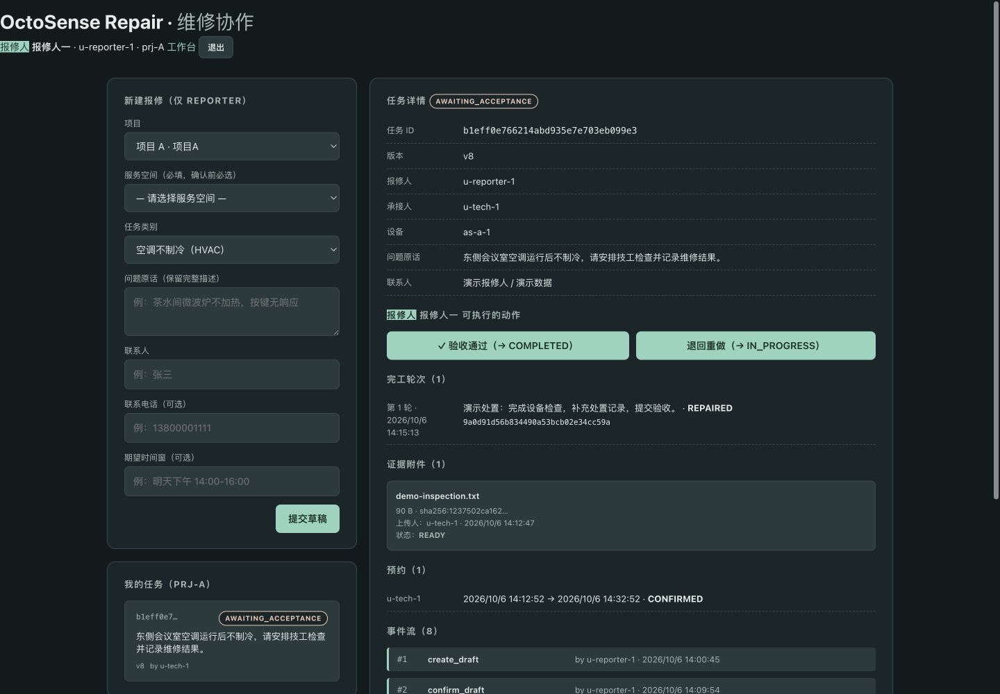
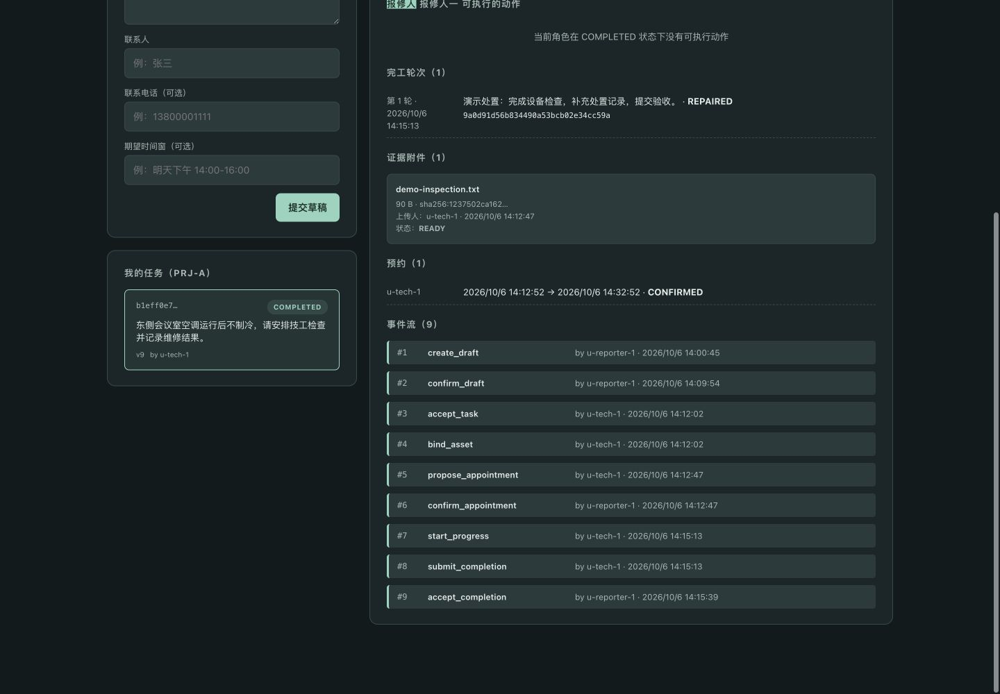

# 展示截图与来源

| 文件 | 展示内容 | 来源 |
|---|---|---|
| [01-role-selection.png](01-role-selection.png) | 演示身份选择 | 10-06 已有实际 Web 截图；身份页样式本轮未修改 |
| [02-reporter-draft.png](02-reporter-draft.png) | 草稿详情与确认报修动作 | 本轮独立本地演示实例真实页面，DRAFT v1 |
| [03-scheduled.png](03-scheduled.png) | 承接技工、绑定设备、确认预约与 READY 附件 | 同一任务，SCHEDULED v6 |
| [04-awaiting-acceptance.png](04-awaiting-acceptance.png) | 完工说明、证据、验收与退回入口 | 同一任务，AWAITING_ACCEPTANCE v8 |
| [05-completed.png](05-completed.png) | 报修人独立验收完成 | 同一任务，COMPLETED v9 |
| [06-event-history.png](06-event-history.png) | 创建、报修、接单、绑定、预约、开工、完工、验收事件链 | 同一任务真实事件流 |
| [07-native-workbench.png](07-native-workbench.png) | 石墨主题原生工作台、身份与分步入口 | 当前 `app/bundle/screenshots/01-main.png` 的原样副本；不是原生闭环通过证据 |

02–06 在本次独立 `runtime/submission-20261006/demo/` 演示库中制作，截图未修改页面内容、未拼贴状态。草稿、确认报修和最终验收通过真实页面操作；技工接单、设备、预约、开工、附件及完工阶段由现有本地 HTTP API 准备，随后真实页面读取并截图。这证明展示状态存在，不把它冒充全程三角色浏览器点击测试。

合成任务：东侧会议室空调不制冷；联系人明确为“演示报修人 / 演示数据”；附件明确为合成演示处置记录，不代表真实现场维修。截图任务 ID 为 `b1eff0e766214abd935e7e703eb099e3`。

